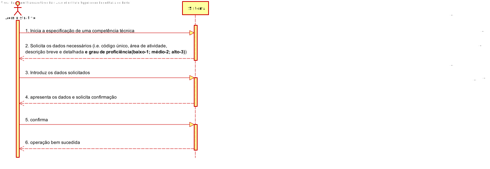
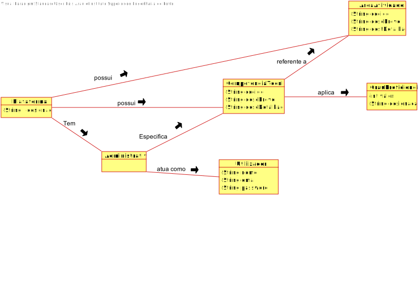
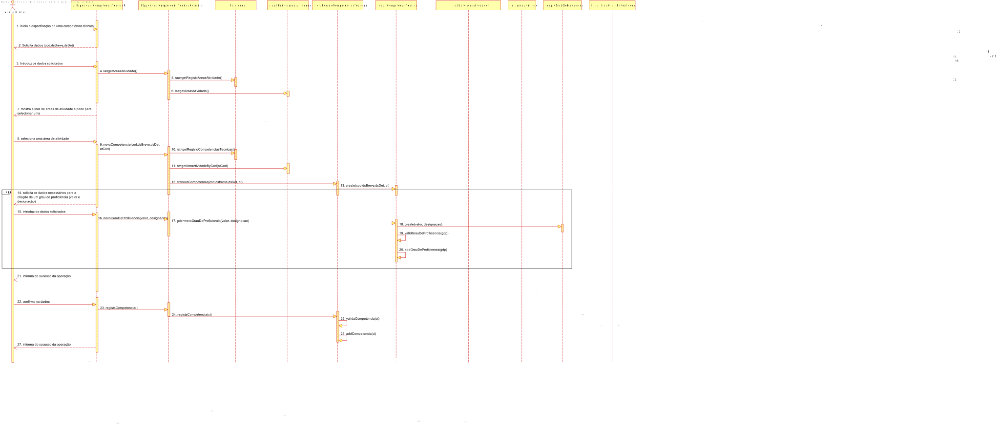
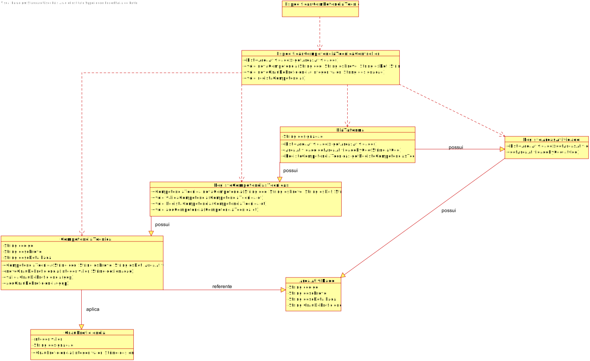

# UC4 - Especificar Competência Técnica

## 1. Engenharia de Requisitos

### Formato Breve

O administrativo inicia a especificação de uma competência técnica **(obrigatória ou desejável)**. O sistema solicita os dados necessários (i.e. código único, área de atividade, descrição breve e detalhada **e grau de proficiência(baixo-1; médio-2; alto-3)**). O administrativo introduz os dados solicitados. O sistema valida e apresenta os dados ao administrativo, pedindo que os confirme. O administrativo confirma os dados. O sistema regista os dados e informa o administrativo do sucesso da operação.

### SSD

### Formato Completo

#### Ator principal

* Administrativo

#### Partes interessadas e seus interesses
* **Administrativo:** pretende especificar as competências técnicas requeridas para a realização de tarefas.
* **Freelancer:** pretende conhecer as competências técnicas que podem ser requeridas para a realização de tarefas.
* **Organização:** pretende contratar pessoas com as competências técnicas requeridas para a realização de tarefas.
* **T4J:** pretende que as competências técnicas estejam descritas com rigor/detalhe.

#### Pré-condições
* n/a

#### Pós-condições
* A informação da nova competência técnica é registada no sistema.

### Cenário de sucesso principal (ou fluxo básico)

1. O administrativo inicia a especificação de uma competência técnica.
2. O sistema solicita os dados necessários (i.e. código único, descrição breve e detalhada).
3. O administrativo introduz os dados solicitados.
4. O sistema mostra a lista de áreas de atividade e pede ao administrativo para selecionar uma.
5. O administrador seleciona uma área de atividade.
6. **O sistema mostra os graus de proficiência aplicáveis a essa competência técnica e pede para selecionar o grau mínimo exigido (baixo-1; médio-2; alto-3).**
7. **O administrador seleciona o grau pretendido.**
8. **O sistema valida e apresenta os dados ao administrativo, pedindo que os confirme.**
9. **O administrativo confirma os dados.**
10. **O sistema regista os dados e informa o administrativo do sucesso da operação.**

#### Extensões (ou fluxos alternativos)

*a. O administrativo solicita o cancelamento da especificação da competência técnica.  
> O caso de uso termina.

4a. Não existem áreas de atividade definidas no sistema.  
>1. O sistema informa o administrativo de tal facto.  
>2. O sistema permite a criação de uma nova área de atividade (UC2).  
> 2a. O administrativo não cria uma área de atividade. O caso de uso termina.

6a. Dados mínimos obrigatórios em falta.
>	1. O sistema informa quais os dados em falta.
>	2. O sistema permite a introdução dos dados em falta (passo 3).  
> 2a. O administrativo não introduz os dados em falta. O caso de uso termina.

6b. O sistema deteta que os dados (ou algum subconjunto dos dados) introduzidos devem ser únicos e que já existem no sistema.
>	1. O sistema alerta o administrativo para o facto.
>	2. O sistema permite a sua alteração (passo 3).  
> 2a. O administrativo não altera os dados. O caso de uso termina.

6c. O sistema deteta que os dados introduzidos (ou algum subconjunto dos dados) são inválidos.
> 1. O sistema alerta o administrativo para o facto.
> 2. O sistema permite a sua alteração (passo 3)..  
> 2a. O administrativo não altera os dados. O caso de uso termina.

#### Requisitos especiais
\-

#### Lista de Variações de Tecnologias e Dados
\-

#### Frequência de Ocorrência
\-

#### Questões em aberto

* Existem outros dados que são necessários?
* Todos os dados são obrigatórios?
* O código único é sempre introduzido pelo administrativo ou o sistema deve gerá-lo automaticamente?
* Para além de ser único, o código tem mais alguma restrição?
* Qual a frequência de ocorrência deste caso de uso?

## 2. Análise OO

### Excerto do Modelo de Domínio Relevante para o UC

## 3. Design - Realização do Caso de Uso

### Racional

| Fluxo Principal | Questão: Que Classe... | Resposta  | Justificação  |
|:--------------  |:---------------------- |:----------|:---------------------------- |
| 1. O administrativo inicia a especificação de uma competência técnica.  |	... interage com o utilizador? | EspecificarCompetenciaTecnicaUI |  Pure Fabrication: não se justifica atribuir esta responsabilidade a nenhuma classe existente no Modelo de Domínio. |
|  		 |	... coordena o UC?	| EspecificarCompetenciaTecnicaController | Controller    |
|  		 |	... cria instância de CompetenciaTecnica? | RegistoCompetenciaTecnica   | HC+LC: Plataforma possui RegistoCompetenciaTecnica.  |
| 2. O sistema solicita os dados necessários (i.e. código único, descrição breve e detalhada).  		 |							 |             |                              |
| 3. O administrativo introduz os dados solicitados.  		 |	... guarda os dados introduzidos?  |   CompetenciaTecnica | Information Expert (IE)-instância criada no passo 1: possui os seus próprios dados.     |
| 4. O sistema mostra a lista de áreas de atividade e pede ao administrativo para selecionar uma.  		 |	... conhece a lista de áreas de atividade?  |  RegistoAreaAtividade  | HC+LC: o RegistoAreaAtividade possui todas as áreas de atividade.                              |
| 5. O administrador seleciona uma área de atividade. | ... guarda a área de atividade selecionada?	| CompetenciaTecnica | IE: possui os próprios dados - no MD a CompetenciaTecnica é referente a uma AreaAtividade.                              |
| 6. O sistema solicita que o administrativo especifique um grau de proficiência (i.e. designação e valor.
| 		|				|			|
| 7. O administrativo introduz os dados solicitados.   		 | ... guarda os dados introduzidos? | CompetenciaTecnica | 	IE: possui os próprios dados. |				| 8. Os passos 6 e 7 repetem-se enquanto não forem introduzidos todos os graus de proficiência pretendidos.
|		|				|			|
| 9. O sistema valida e apresenta os dados ao administrativo, pedindo que os confirme. | ...valida os dados da CompetenciaTecnica (validação local)? | CompetenciaTecnica | IE: possui os seus próprios dados. |
|		| ...valida os dados da CompetenciaTecnica (validação global)? | RegistoCompetenciaTecnica | HC+LC: o RegistoCompetenciaTecnica agrega CompetenciaTecnica. |
| 10. O administrativo confirma os dados. 
|			|				|			|
| 11. O sistema regista os dados e informa o administrativo do sucesso da operação. | ...guarda a CompetenciaTecnica criada? | RegistoCompetenciaTecnica |  HC+LC: o RegistoCompetenciaTecnica agrega CompetenciaTecnica. 
|
 		 

### Sistematização ##

 Do racional resulta que as classes conceptuais promovidas a classes de software são:

 * Plataforma
 * CompetenciaTecnica

Outras classes de software (i.e. Pure Fabrication) identificadas:  

 * EspecificarCompetenciaTecnicaUI  
 * EspecificarCompetenciaTecnicaController

###	Diagrama de Sequência

###	Diagrama de Classes

