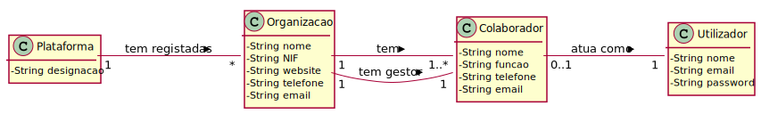
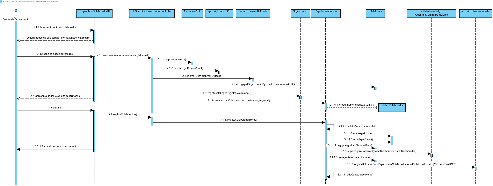

# UC5 - Especificar Colaborador de Organização

## 1. Engenharia de Requisitos

### Formato Breve

O gestor de organização inicia a especificação de um colaborador da sua organização. O sistema solicita os dados necessários (i.e. nome, função, contacto telefónico, endereço de email). O gestor de organização introduz os dados solicitados. O sistema valida e apresenta os dados ao gestor de organização, pedindo que os confirme. O gestor de organização confirma. O sistema regista os dados do colaborador, gera a sua password **(gerada pela plataforma recorrendo a um algoritmo externo e remetida para o email único do utilizador)**, torna-o um utilizador registado e informa o gestor de organização do sucesso da operação.

### SSD

### Formato Completo

#### Ator principal

* Gestor de Organização

#### Partes interessadas e seus interesses
* **Gestor de Organização:** pretende especificar os colaboradores da sua organização.
* **Organização:** pretende que os seus colaboradores esteja registados para que estes possam atuar em sua representação.
* **T4J:** pretende que as organizações possam registar colaboradores seus.

#### Pré-condições
* n/a

#### Pós-condições
* A informação do novo colaborador de organização é registada no sistema.
* O colaborador também se torna um utilizador registado sistema.

### Cenário de sucesso principal (ou fluxo básico)

1. O gestor de organização inicia a especificação de um colaborador da sua organização.
2. O sistema solicita os dados necessários (i.e. nome, função, contacto telefónico, endereço de email).
3. O gestor de organização introduz os dados solicitados.
4. O sistema valida e apresenta os dados ao gestor de organização, pedindo que os confirme.
5. O gestor de organização confirma os dados.
6. O sistema regista os dados do colaborador, gera a sua password, torna-o um utilizador registado**(gerada pela plataforma recorrendo a um algoritmo externo e remetida para o email único do utilizador)** e informa o gestor de organização do sucesso da operação.

#### Extensões (ou fluxos alternativos)

*a. O gestor de organização solicita o cancelamento da especificação de um colaborador da sua organização.

> O caso de uso termina.

4a. Dados mínimos obrigatórios em falta.
>	1. O sistema informa quais os dados em falta.
>	2. O sistema permite a introdução dos dados em falta (passo 3)
>
	>	2a. O gestor de organização não altera os dados. O caso de uso termina.

4b. O sistema deteta que os dados (ou algum subconjunto dos dados) introduzidos devem ser únicos e que já existem no sistema.
>	1. O sistema alerta o gestor de organização para o facto.
>	2. O sistema permite a sua alteração (passo 3)
>
	>	2a. O gestor de organização não altera os dados. O caso de uso termina.

4c. O sistema deteta que os dados introduzidos (ou algum subconjunto dos dados) são inválidos.
> 1. O sistema alerta o gestor de organização para o facto.
> 2. O sistema permite a sua alteração (passo 3).
>
	> 2a. O gestor de organização não altera os dados. O caso de uso termina.

#### Requisitos especiais
\-

#### Lista de Variações de Tecnologias e Dados
\-

#### Frequência de Ocorrência
\-

#### Questões em aberto

* Existem outros dados que são necessários?
* Todos os dados são obrigatórios?
* Qual ou quais os dados que identificam de forma única um colaborador de organização?
* Qual a frequência de ocorrência deste caso de uso?

## 2. Análise OO

### Excerto do Modelo de Domínio Relevante para o UC

## 3. Design - Realização do Caso de Uso

### Racional

| Fluxo Principal | Questão: Que Classe... | Resposta  | Justificação  |
|:--------------  |:---------------------- |:----------|:---------------------------- |
| 1. O gestor de organização inicia a especificação de um colaborador da sua organização.   		 |	... interage com o utilizador? | EspecificarColaboradorUI    |  Pure Fabrication: não se justifica atribuir esta responsabilidade a nenhuma classe existente no Modelo de Domínio. |
|  		 |	... coordena o UC?	| EspecificarColaboradorController | Controller    |
|  		 |	... cria instância de Colaborador?| Organizacao   | Creator (Regra1): no MD a Organização tem Colaborador.   |
||...conhece o utilizador/gestor a usar o sistema?|SessaoUtilizador|IE: cf. documentação do componente de gestão de utilizadores.|
||...sabe a que organização o utilizador/gestor pertence?|Plataforma|IE: conhece todas as organizações.|
|||Organização|IE: conhece o seu gestor/colaborador.|
|||Colaborador|IE: conhece os seus dados (e.g. email). |
| 2. O sistema solicita os dados necessários (i.e. nome, função, contacto telefónico, endereço de email).  		 |							 |             |                              |
| 3. O gestor de organização introduz os dados solicitados.  		 |	... guarda os dados introduzidos?  |   Colaborador | Information Expert (IE) - instância criada no passo 1: possui os seus próprios dados.     |
| 4. O sistema valida e apresenta os dados ao gestor de organização, pedindo que os confirme.   		 |	... valida os dados do Colaborador (validação local) | Colaborador |      IE: possui os seus próprios dados.|  	
|	 |	... valida os dados do Colaborador (validação global) | Organizacao  | IE: a Organizacao contém/agrega Colaborador.  |
| 5. O gestor de organização confirma os dados.   		 |							 |             |                              |
| 6.  O sistema regista os dados do colaborador, gera a sua password, torna-o um utilizador registado**(gerada pela plataforma recorrendo a um algoritmo externo e remetida para o email único do utilizador)** e informa o gestor de organização do sucesso da operação. 		 |	... guarda o Colaborador criado? | Organizacao  | IE: a Organizacao contém/agrega Colaborador.|  
|| ... regista/guarda o Utilizador referente ao Colaborador? | AutorizacaoFacade  | IE: a gestão de utilizadores é responsabilidade do componente externo respetivo, cujo ponto de interação é através da classe "AutorizacaoFacade".|

### Sistematização ##

 Do racional resulta que as classes conceptuais promovidas a classes de software são:

 * Organizacao
 * Colaborador
 * Plataforma

Outras classes de software (i.e. Pure Fabrication) identificadas:  

 * EspecificarColaboradorUI  
 * EspecificarColaboradorController

Outras classes de sistemas/componentes externos:

 * SessaoUtilizador
 * AutorizacaoFacade

###	Diagrama de Sequência

###	Diagrama de Classes

