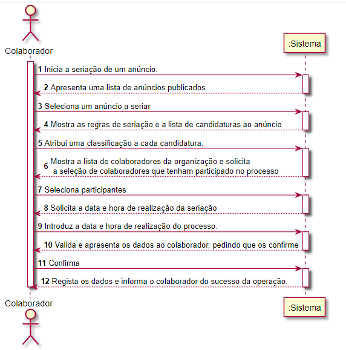
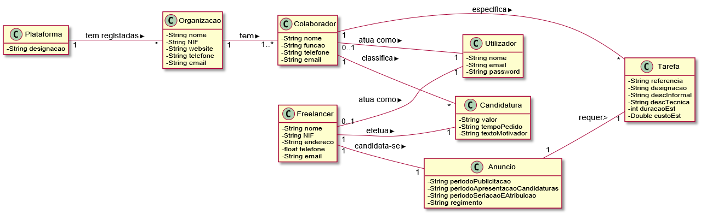
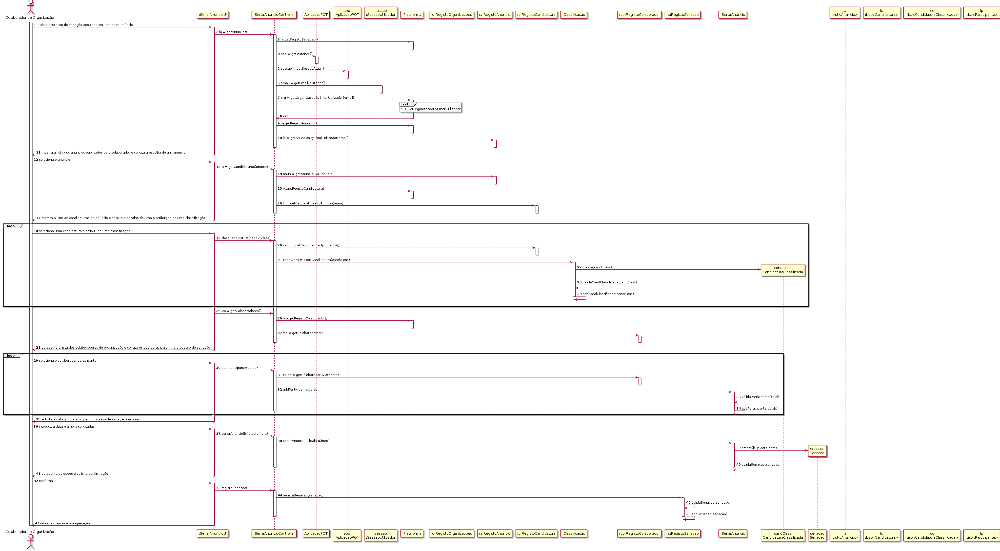
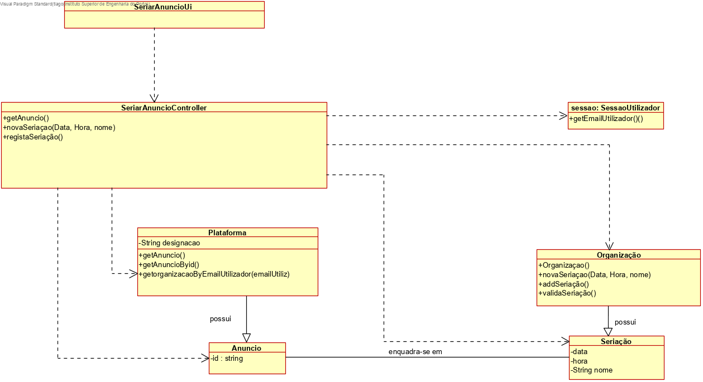

# UC 10 - Seriar Anúncio

## 1. Engenharia de Requisitos

### Formato Breve
O colaborador de organização inicia a seriação das candidaturas do anúncio. O sistema apresenta a lista de candidaturas. O colaborador de organização classifica todas as candidaturas. O sistema apresenta lista de candidaturas organizada e solicita a confirmação. O colaborador de organização confirma. O sistema regista a lista de candidaturas organizada e informa o colaborador de organização do sucesso da operação.

### SSD

### Formato Completo

#### Ator principal

Colaborador de Organização

#### Partes interessadas e seus interesses

* **Colaborador de Organização:** pretende que a lista de candidaturas esteja organizada de modo a facilitar a atribuição da tarefa.
* **Freelancer:** pretende que a tarefa lhe seja atribuída.

#### Pré-condições

O regimento aplicado tem que ser não automático.

#### Pós-condições

A lista ordenada de candidaturas é registada no sistema.

#### Cenário de sucesso principal (ou fluxo básico)

1. O colaborador de organização inicia a seriação das candidaturas do anúncio.
2. O sistema apresenta a lista de candidaturas.
3. O colaborador de organização classifica todas as candidaturas.
4. O sistema apresenta lista de candidaturas organizada e solicita a confirmação.
5. O colaborador de organização confirma.
6. O sistema regista a lista de candidaturas organizada e informa o colaborador de organização do sucesso da operação.

#### Extensões (ou fluxos alternativos)

*a. O colaborador de organização solicita o cancelamento da seriação.

> O caso de uso termina.

#### Requisitos especiais

\-

#### Lista de Variações de Tecnologias e Dados

\-

#### Frequência de Ocorrência

\-

#### Questões em aberto

* O colaborador de organização pode excluir alguém da lista?

## 2. Análise OO

### Excerto do Modelo de Domínio Relevante para o UC

## 3. Design - Realização do Caso de Uso

### Racional

| Fluxo Principal | Questão: Que Classe... | Resposta  | Justificação  |
|:--------------  |:---------------------- |:----------|:---------------------------- |
|1. O colaborador da organizacão inicia a seriação de candidatura de anuncio| ...interage com o colaborador? |  ... SeriarAnuncioUI | Pure Fabrication: nao se justifica atribuir esta responsabilidade a nenhuma classe existente no Modelo de Dominio. |
||...coordena o UC?| SeriarAnuncioController | Controller |
||... cria instância de Seriação | RegistaSeriação | Creator (regra1): seria a organização mas, por aplicação de HC+LC a organização delegaria essa responsabilidade em RegistoSeriação.|
||...quem conhece a o RegistaSeriação?| candidatura | Aplicação do HC+LC.|
||...conhece o utilizador a usar o sistema?| SessaoUtilizador |IE: cf.documentaçao do componente de gestão de utilizadores.|
||...sabe a que organização o colaborador pertence? |Plataforma | IE:conhece todas as organizações.|
|||organização| IE:conhece os seus colaboradores.|
|||Colaborador | IE:conhece os dados.|
|2. O sistema solicita os dados necessários.||||
|3. O colaborador da organização introduz os dados solicitados.| ... guarda os dados introduzidos?| Seriação| Information Expert (IE)- instancia criada no passo 1: possui os seus proprios dados.|
|4. O sistema mostra a lista das candidaturas existentes e pede ao Colaborador para selecionar uma.|...conhece a lista das candidaturas?| Plataforma| IE: no MD a plataforma possui todas as instancias de candidatura.|
|5. O colaborador seleciona a candidatura que deseja seriar .| ...guarda a candidatura selecionada?| Seriação| IE: possui os proprios dados.|
|6. O sistema valida e apresenta os dados ao colaborador de organização, pedindo que os confirme.| ...valida os dados da seriação (Validaçaõ local)?|Seriaçao| IE: possui os seus proprios dados.|
||...valida os dados da seriação (Validaçaõ global)?| Organização|IE: a organização contem seriação.|
|7. O colaborador de organização confirma os dados.||||
|8. O sistema regista os dados e informa o colaborador de organização do sucesso da operação.|...guarda a seriação criada?| RegistaSeriação | IE: a candidatura contem a seriação e delega em RegistoSeriação (HC+LC).|
||....informa o colaborador?| SeriarAnuncioUI|

       

### Sistematização ##

 Do racional resulta que as classes conceptuais promovidas a classes de software são:

 * Plataforma
 * Organização
 * Seriação
 * RegistaSeriação

Outras classes de software (i.e. Pure Fabrication) identificadas:  

 * SeriarAnuncioUI 
 * SeriarAnuncioController

###	Diagrama de Sequência

###	Diagrama de Classes

