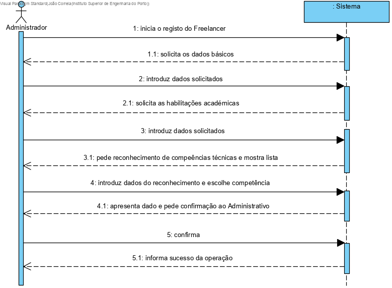
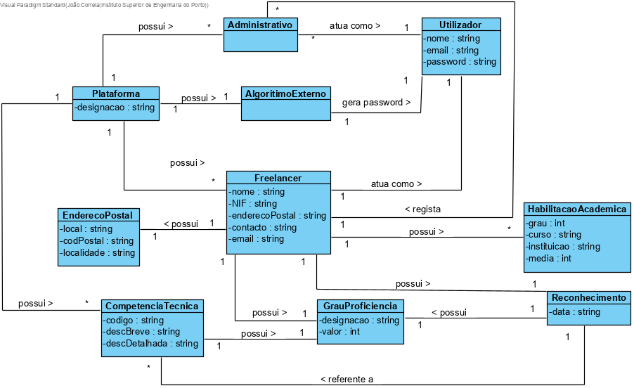
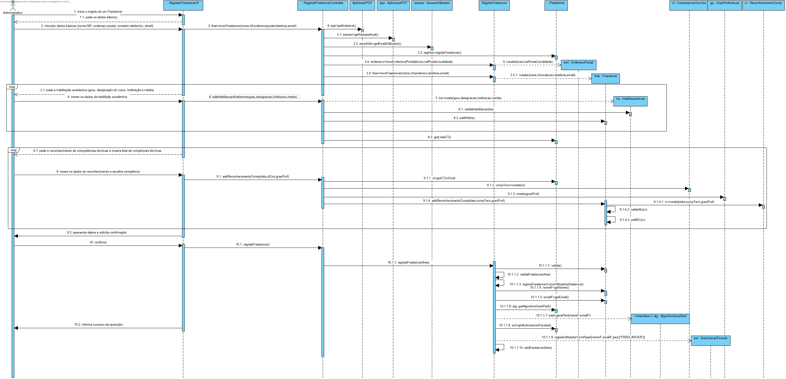
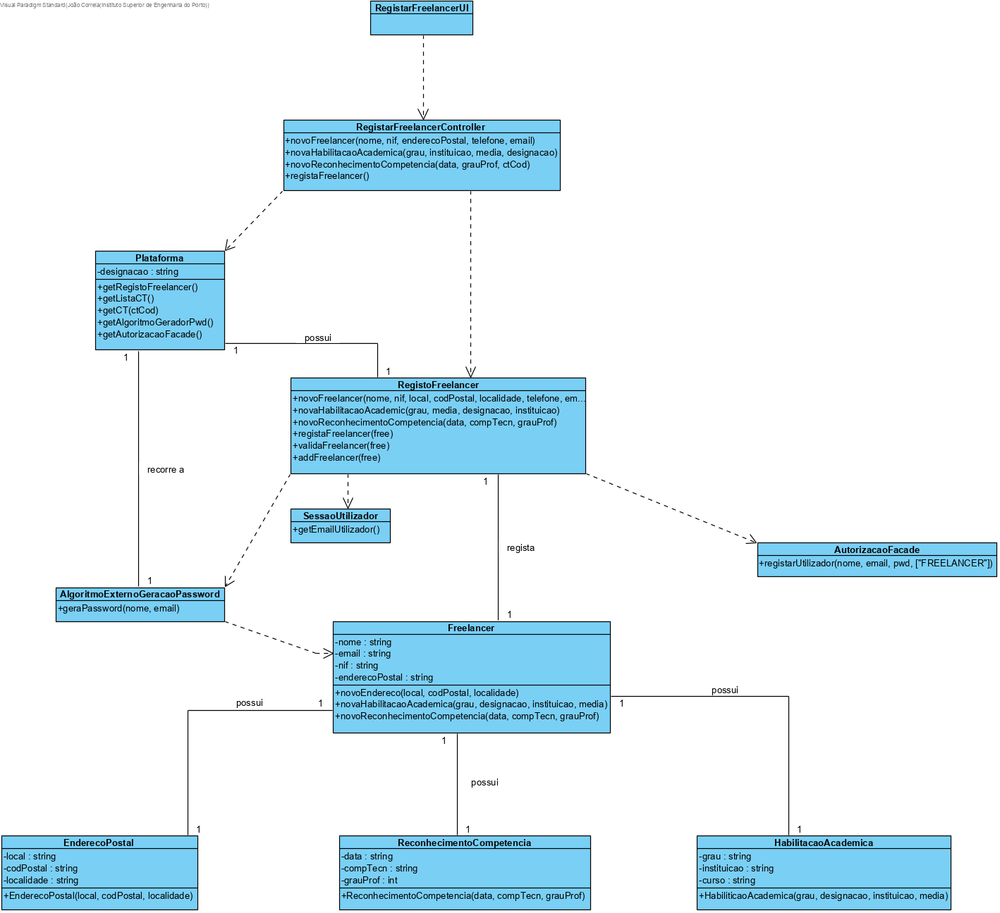

# UC7 - REGISTAR FREELANCER

## 1. Engenharia de Requisitos

### Formato Breve

O Administrador inicia o registo do Freelancer introduzindo os dados básicos (nome, NIF, endereço postal, contacto telefonico, email) e a habilitação académica (grau do curso, designação do curso, instituição onde relizou o curso e a média do curso). O administrador introduz o reconhecimento das competências técnicas e escolhe as competências na lista de competências técnicas. Após o administrativo confirmar o Freelancer irá no email introduzido receber uma password gerada por um algoritmo externo.

### SSD

### Formato Completo

#### Ator principal

Freelancer

#### Partes interessadas e seus interesses

* **Administrativo:** pretende registar o Freelancer na aplicação.

#### Pré-condições

#### Pós-condições
O Freelancer é registado na aplicação.

#### Cenário de sucesso principal (ou fluxo básico)

1. O administrador inicia o registo de um Freelancer.   
2. O sistema solicita os dados básicos ( nome, NIF, endereço postal, contacto telefonico, email).
3. O administrador introduz os dados solicitados.
4. O sistema pede a habilitação académica (grau, designação do curso, instituição e média).
5. O administrador insere os dados solicitados.
6. O sistema pede o reconhecimentode competências técnicas e mostra lista.
7. O administrador introduz os dados.
8. O sistema apresenta os dados e solicita confirmação.
9. O administrador confirma.

#### Extensões (ou fluxos alternativos)

*a. O Administrador solicita o cancelamento do registo do Freelancer.

> O caso de uso termina.

4a. Dados em falta.
>	1. O sistema informa os dados em falta.
>	2. O sistema disponibliza a introdução dos dados (passo 3).
>
>>2a. O Administrador não altera os dados. O caso de uso termina.

4b. O sistema informa que exitem dados introduzidos os quais devem ser únicos e que já existem no sistema.
>	1. O sistema alerta o administrativo para o facto.
>	2. O sistema permite a alteração dos dados(passo 3).
>
>>2a. O Administrador não altera os dados. O caso de uso termina.

4c. O sistema deteta que existem dados  introduzidos inválidos.
> 	1. O sistema alerta o Administrativo.
> 	2. O sistema permite a alteração dos dados (passo 3).
>
> >2a. O Administrador não altera os dados. O caso de uso termina. 

6a. Dados em falta.

>	1.O sistma informa ao Administrador sobre os dados em falta.
>	2.O sistema permite a intodução dos dados (passo 5).
>
>>2a. O Administrador não altera os dados. O caso de uso termina. 
 
6b. O sistema detecta que existem dados introduzidos inválidos.

>	1.O sistema alerta o Administrador para o facto.
>	2.O sistema permite a sua alteração (passo 5).
>
>>2a. O Administrador não altera os dados. O caso de uso termina. 

8a.  Dados em falta.

>	1.O sistma informa ao Administrador sobre os dados em falta.
>	2.O sistema permite a intodução dos dados (passo 7).
>
>>2a. O Administrador não altera os dados. O caso de uso termina. 

8b.O sistema detecta que existem dados introduzidos inválidos.

>	1.O sistema alerta o administrativo para o facto.
>	2.O sistema permite a sua alteração (passo 7).
>
>>2a. O Administrador não altera os dados. O caso de uso termina. 
 

#### Requisitos especiais
-

#### Lista de Variações de Tecnologias e Dados
-

#### Frequência de Ocorrência
-

#### Questões em aberto

1. Qual a frequência de ocorrência deste caso de uso?
2. Existem outros dados obrigatórios?

(lista de questões em aberto, i.e. sem uma resposta conhecida.)

## 2. Análise OO

### Excerto do Modelo de Domínio Relevante para o UC

## 3. Design - Realização do Caso de Uso

### Racional

| Fluxo Principal | Questão: Que Classe... | Resposta  | Justificação  |
|:--------------  |:---------------------- |:----------|:---------------------------- |
| 1. O Administrativo inicia o registo de um freelancer.		 | ... interage com o utilizador?							 |     RegistarFreelancerUI        |      Pure Fabrication, pois não se justifica atribuir esta responsabilidade a nenhuma classe existe no Modelo de Domínio.      |
||... que coordena o UC?| RegistarFreelancerController | Controller |
||... cria instância de Freelancer | Freelancer | IE pois tem todos os mecanismos necessários para desempenhar essa tarefa |
|2. O sistema pede os dados básicos(nome, NIF, endereço postal, contacto, email). ||||
|3. O Administrativo insere os dados. | ... guarda os dados introduzidos? | Freelancer | IE - instância criada no passo 1: possui os seus próprios dados. |
|4. O sistema pede as habilitações académicas(grau, designação do curso e instituição). |||
|5. Oadministrativo insere os dados das habilitações académicas. | ... guarda os dados? | RegistarFreelancerController | Controller |
|6. **Os pontos 4 e 5 repetêm-se até o freelancer não ter mais habilitações.** |||
|7. O sistema pede oreconhecimento de competências técnicas(data, competências técnicas e grau de proficiencia). |||
|8. O administratico insere os dados do reconhecimento. | ... guardaos daos? | Freelancer | IE: possui os seus próprios dados. |
|9. **Os pontos 6 e 7 repetêm-se até o freelancer não ter mais reconhecimentos.** |||
|10. O sistema valida e apresenta os dados ao administrativo, pedindo que os confirme. | ... valida os dados Freelancer (validação local) | Freelancer | IE: O Freelancer possui os seus próprios dados. |
|| ... valida os dados do Freelancer(validação global). | Plataforma | IE: A Plataforma possui Freelancer. |
|11. O administrativo confirma. |||
|12. O sistema regista o freelancer e indica o sucesso da operação. | ... guarda o Freelancer? | Plataforma | IE: No MD a Plataforma possui Freelancer. |

### Sistematização ##

 Do racional resulta que as classes conceptuais promovidas a classes de software são:

 * Freelancer
 * HabilitaçõesAcademica
 * ReconhecimentoCompetencia
 * Plataforma

Outras classes de software (i.e. Pure Fabrication) identificadas:  

 * RegistarFreelancerUI  
 * RegistarFreelancerController

Outras classes de sistemas/componentes exteros:

 * SessaoUtilizador
 * AutorizacaoFacade

#### Diagrama de Sequência

 

#### Diagrama de Classes

 
