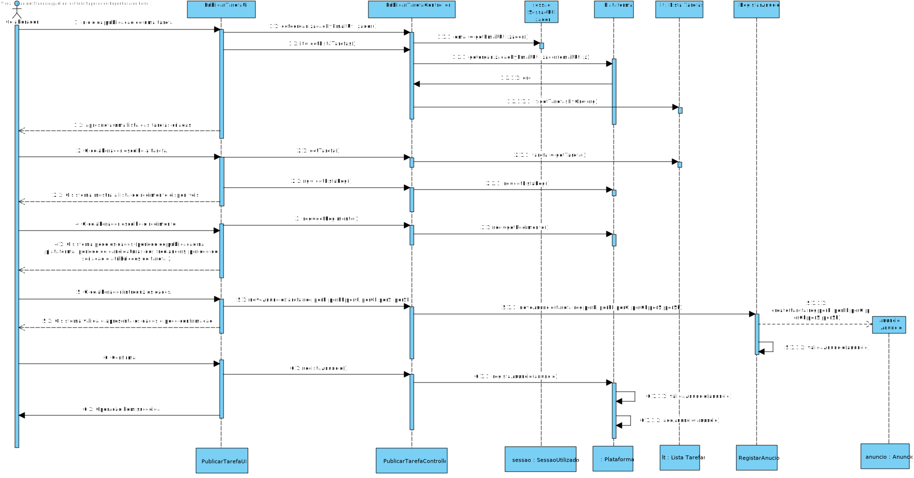

# UC8 - Publicar Tarefa

## 1. Engenharia de Requisitos

### Formato Breve

O Colaborador da Organização inicia a publicaçao de uma tarefa.
O sistema pede os dados (período de publicação na plataforma, período de candidaturas dos freelancers, periodo de seriação e atribuições de tarefa e tipo de regime aplicável).
O colaborador introduz os dados.
O sistema valida e apresenta os dados ao Colaborador, pedindo que os confirme.
O colaborador confirma os dados 
O sistema regista os dados e informa o Colaborador do sucesso da operação. 

### SSD

### Formato Completo

#### Ator principal

* Colaborador da organização

#### Partes interessadas e seus interesses
* **Freelancer:** pretende candidatar se a um anuncio.
* **Organização:** pretende publicar os anunncios.
* **T4J:** pretende que os anuncios estejam publicados na sua plataforma.

#### Pré-condições
* n/a

#### Pós-condições
* O anuncio fica registado na Plaatforma.

### Cenário de sucesso principal (ou fluxo básico)

1.O Colaborador da Organização inicia a publicaçao de uma tarefa.
2.O sistema retorna lista de tarefas criadas
3.O colaborador escolhe a tarefa.
4.O sistema mostra a lista de regimento disponiveis
5.O colaborador escolhe o regimento
6.O sistema pede os dados (período de publicação na plataforma, período de candidaturas dos freelancers, periodo de seriação e atribuições de tarefa e tipo de regime aplicável).
7.O colaborador introduz os dados.
8.O sistema valida e apresenta os dados ao Colaborador, pedindo que os confirme.
9.O Colaboradorconfirma.
10.O sistema regista os dados e informa o Colaborador do sucesso da operação.

#### Extensões (ou fluxos alternativos)

*a. O Colaborador solicita o cancelamento da publicaçao do anuncio.  
> O caso de uso termina.

4a. Não existe tarefa definida no sistema.  
>1. O sistema informa o administrativo de tal facto.  
>2. O sistema permite a criação de uma nova tarefa . 
 
> 2a. O Colaborador não cria uma tarefa. O caso de uso termina.

6a. Não existe regimento definida no sistema.  
>1. O sistema informa o administrativo de tal facto.  
>2. O sistema permite a criação de um novo regimento. 
 
> 2a. O Colaborador não cria uma regimento. O caso de uso termina.

8a. Dados do codigo incompletos.
>1-O sistema informa quais os dados em falta.
>2-O sistema permite a introdução dos dados em falta.

>  2a. O utilizador não registado não altera os dados. O caso de uso termina.

8b.Dados mínimos obrigatórios em falta.
>1-O sistema informa quais os dados em falta.
>2-O sistema permite a introdução dos dados em falta.

> 2a. O utilizador não registado não altera os dados. O caso de uso termina.

8c. O sistema deteta que os dados (ou algum subconjunto dos dados) introduzidos devem ser únicos e que já existem no sistema.

>1-O sistema alerta o utilizador não registado para o facto.
>2-O sistema permite a sua alteração (passo 3)

> 2a. O utilizador não registado não altera os dados. O caso de uso termina. 

8d. O sistema deteta que os dados introduzidos não correspondem ao formato de dados pretendidos.

>1-O sistema informa quais os dados em que estão no formato diferente.
>2-O sistema permite a introdução desses dados.
 
> 2a. O utilizador não registado nao altera os dados. caso de uso termina.

#### Requisitos especiais
\-

#### Lista de Variações de Tecnologias e Dados
\-

#### Frequência de Ocorrência
\-

#### Questões em aberto

* Existe algum tempo limite para uma tarefa estar publicada?

## 2. Análise OO

### Excerto do Modelo de Domínio Relevante para o UC

## 3. Design - Realização do Caso de Uso

### Racional

| Fluxo Principal | Questão: Que Classe... | Resposta  | Justificação  |
|:--------------  |:---------------------- |:----------|:---------------------------- |
| 1: inicio da publicação de uma tarefa  |	... interage com o utilizador? | PublicarTarefaUI |  Pure Fabrication: não se justifica atribuir esta responsabilidade a nenhuma classe existente no Modelo de Domínio. |
|  		 |	... coordena o UC?	| PublicarTarefaController | Controller    |
|  		 |	... cria instância de Anuncio? | RegistarAnuncio   | High cohesion e low Coupling  |
| 2.  apresneta uma lista das tarefas criadas  		 |		   |           |    |
| 3. O colaborador escolhe a tarefa.  		 |	... guarda a tarefa escolhida?  |   RegistoOrganizacao| High cohesion e low Coupling     |
| 4. O sistema mostra a lista de regimento disponiveis.  		 |	... guarda os regimentos  |   |                        |
| 5. O colaborador escolhe o regimento. | ... guarda o regimento escolhido?	| 		|                      |
| 6. O sistema pede os dados (período de publicação na
plataforma, período de candidaturas dos freelancers, periodo de
seriação e atribuições de tarefa ).   		 |	 | 	 |     |  	
| 7. O colaborador introduz os dados.   		 |... guarda os dados introduzidos		Anuncio	 |  information Expert           |
| 8. O sistema valida e apresenta os dados e pede confirmação.  		 |	...valida os do anuncio | Anuncio | IE: Possi os seus proprios dados |  
| 9. Confirma.  		 |			 | 			  | 				 |  
| 10. Operação bem sucedida.  		 |	... guarda a anuncio criado? | RegistarAnuncio  |  High cohesion e low Coupling |  

### Sistematização ##

 Do racional resulta que as classes conceptuais promovidas a classes de software são:

 * Plataforma
 * Anuncio

Outras classes de software (i.e. Pure Fabrication) identificadas:  

 * PublicarTarefaUI  
 * PublicarTarefaController

###	Diagrama de Sequência

###	Diagrama de Classes

