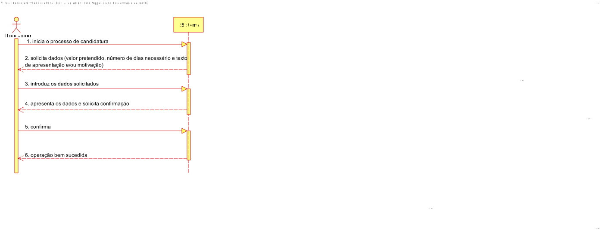
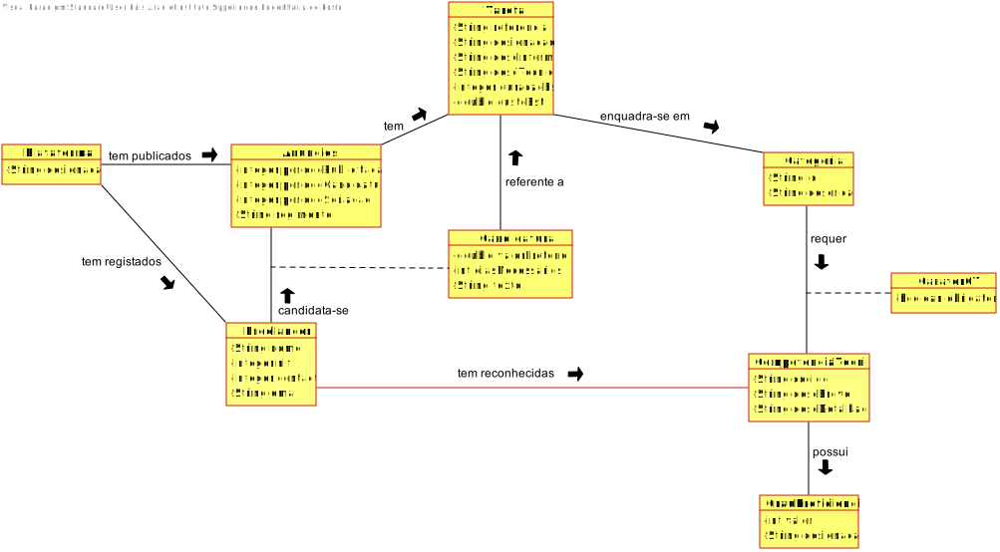
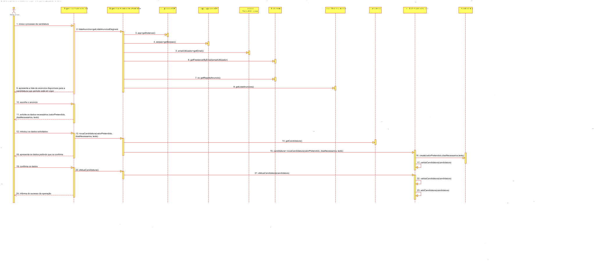
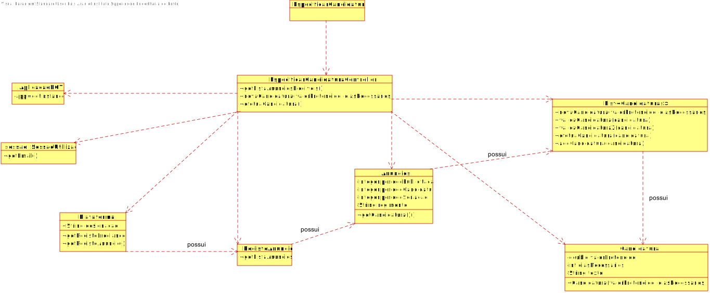

# UC9- Efetuar Candidatura

## 1. Engenharia de Requisitos

### Formato Breve
O Freelancer inicia o processo de candidatura. O sistema solicita os dados necessários (i.e. valor pretendido, número de dias necessário e texto de apresentação e/ou motivação). O Freelancer introduz os dados solicitados. O sistema valida e apresenta os dados ao Freelancer, pedindo que os confirme. O Freelancer confirma. O sistema regista os dados e informa o Freelancer do sucesso da operação.

### SSD

### Formato Completo

#### Ator principal

Freelancer

#### Partes interessadas e seus interesses

* **Freelancers:** pretendem realizar a sua candidatura.
* **T4J:** pretende que os Freelancers realizem a sua candidatura.

#### Pré-condições
Têm que existir anúncios definidos no sistema.
O Freelancer tem que ter o grau de proficiência mínimo exigido para essa candidatura.

#### Pós-condições
As informações dos Freelancers é registada no sistema.
#### Cenário de sucesso principal (ou fluxo básico)

1.	O Freelancer inicia o processo de candidatura.
2.	O sistema apresenta a lista de anúncios disponíveis para a candidatura cujo período está 	em vigor.
3.	O Freelancer escolhe um anúncio.
4.	O sistema solicita os dados necessários (valor pretendido, número de dias necessário e 	texto de apresentação e/ou motivação).

5.	O Freelancer introduz os dados necessários.
6.	O sistema valida e apresenta os dados ao Freelancer, pedindo que
	os confirme.

7.	O Freelancer confirma.
8.	O sistema regista os dados e informa o Freelancer do sucesso da
	operação.

#### Extensões (ou fluxos alternativos)

a.O Freelancer solicita o cancelamento da sua candidatura.
O caso de uso termina.

4a. Dados mínimos obrigatórios em falta.
1.	   O sistema informa quais os dados em falta.
2.	O sistema permite a introdução dos dados em falta (passo 3)
2a. O Freelancer não altera os dados. O caso de uso termina.

4b. O sistema deteta que os dados (ou algum subconjunto dos dados) introduzidos
devem ser únicos e que já existem no sistema.
1.	O sistema alerta o Freelancer para o facto.
2.	O sistema permite a sua alteração (passo 3)
2a. O Freelancer não altera os dados. O caso de uso termina.

4c. O sistema deteta que os dados introduzidos (ou algum subconjunto dos dados) são inválidos.
1.	O sistema alerta o Freelancer para o facto.
2.	O sistema permite a sua alteração (passo 3).
2a. O Freelancer não altera os dados. O caso de uso termina.

4d. O sistema deteta que a lista não tem tarefas.
1. O sistema alerta o Freelancer para o facto e o caso de uso termina. 
 
4e. O Freelancer não possui grau de proficiência para as tarefas publicadas.
1. O sistema alerta o Freelancer para o facto e o caso de uso termina. 

4f. O sistema deteta que não existem anúncios elegíveis.
1. O sistema alerta o Freelancer para o facto e o caso de uso termina. 

4g. O sistema deteta que o dia não está em vigor.
1. O sistema alerta o Freelancer para o facto e o caso de uso termina. 

#### Requisitos especiais

\-

#### Lista de Variações de Tecnologias e Dados

\-

#### Frequência de Ocorrência

\-

#### Questões em aberto

•	Existem outros dados necessários?

•	Todos os dados são obrigatórios?

• 	Qual a frequência de ocorrência deste caso de uso?

## 2. Análise OO

### Excerto do Modelo de Domínio Relevante para o UC

## 3. Design - Realização do Caso de Uso

### Racional

| Fluxo Principal | Questão: Que Classe... | Resposta  | Justificação  |
|:--------------  |:---------------------- |:----------|:---------------------------- |
| 1. O Freelancer inicia o processo de candidatura.  		 |	...interage com o utilizador?  | EspecificarCandidaturaUI | Pure Fabrication|
||...coordena o UC?| EspecificarCandidaturaController| Controller| 
||… conhece a lista de anúncios elegível para o Freelancer?| RegistaAnúncio | HC+LC: o RegistoAnuncio conhece todos os anúncios.|	
|			|		| Plataforma| 	IE: a Plataforma possui o RegistoAnuncio.|
||… conhece o Freelancer a usar o sistema?	|SessaoUtilizador | IE: cf. documentação do componente de gestão de utilizadores.	|
||	...sabe que email pertence ao Freelancer? | Plataforma | IE: conhece todos os Freelancers. |
||… cria instâncias de Candidatura? | Anúncios | Creator (regra 1) |
| 2. O sistema apresenta a lista de anúncios disponíveis para a candidatura.  |			   |                             |                              |
| 3. O Freelancer escolhe uma das listas de anúncios.   		 | … armazena o anúncio escolhido? |  RegistoAnuncio           |         HC+LC: o RegistoAnuncio conhece todos os anúncios. |
| 4. O sistema solicita os dados necessários (i.e valor pretendido, número de dias necessário e texto de apresentação e/ou motivação).		 |			      |             |                              |                  
| 5. O Freelancer introduz os dados solicitados. 		 |	... guarda os dados introduzidos?	 |      Candidatura       |      Information Expert (IE) - instância criada no passo 1.                        |
| 6.O sistema valida e apresenta os dados ao Freelancer, pedindo que os confirme.  		 |		... valida os dados da Candidatura(validação local) |     Candidatura        |   IE: possui os seus próprios dados. ||    
||	... valida os dados do Candidatura (validação global) |Anúncios |IE: os Anúncios contêm/agregam Candidatura |    
| 7. O Freelancer confirma. |		| 		|			|
|8. O sistema regista os dados e informa o Freelancer do sucesso da operação. | ... guarda a Candidatura criada? | Anúncios | IE: os Anúncios contêm/agregam Candidatura |

### Sistematização ##

 Do racional resulta que as classes conceptuais promovidas a classes de software são:

 * Plataforma;
 * Candidatura;
 * Anúncios;
 * RegistoAnuncio.  

Outras classes de software (i.e. Pure Fabrication) identificadas:  

 * EspecificarCandidaturaUI;  
 * EspecificarCandidaturaController;

###	Diagrama de Sequência

###	Diagrama de Classes

