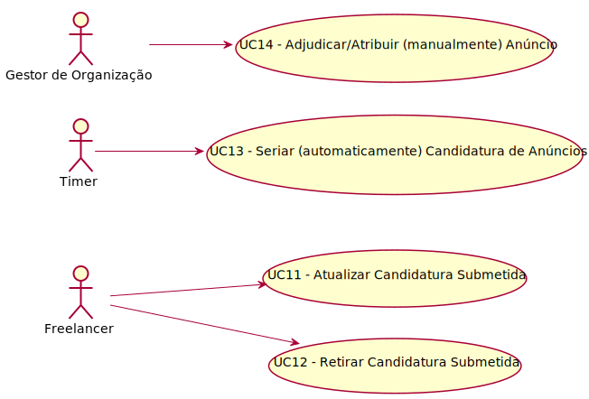

# Diagrama de Casos de Uso

**Para cada caso de uso deve ser realizada a sua descrição (perspetiva de engenharia de requisitos) e a sua realização (perspetiva de design).**

# Casos de Uso
| UC  | Descrição                                                               |                   
|:----|:------------------------------------------------------------------------|
| UC11 | [Atualizar Candidatura Submetida](UC11/UC11_AtualizarCandidaturaSubmetida.md)   |
| UC12 | [Retirar Candidatura Submetida](UC12/UC12_RetirarCandidaturaSubmetida.md)  |
| UC13| [Seriar (automaticamente) Candidaturas de Anúncios](UC13/UC13_SeriarCandidaturasAnuncios.md)|
| UC14 | [Adjudicar/Atribuir (manualmente) Anúncio](UC14/UC14_AdjudicarAtribuirAnuncio.md)|
