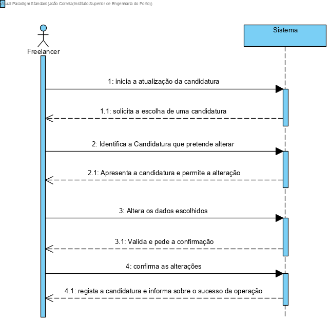
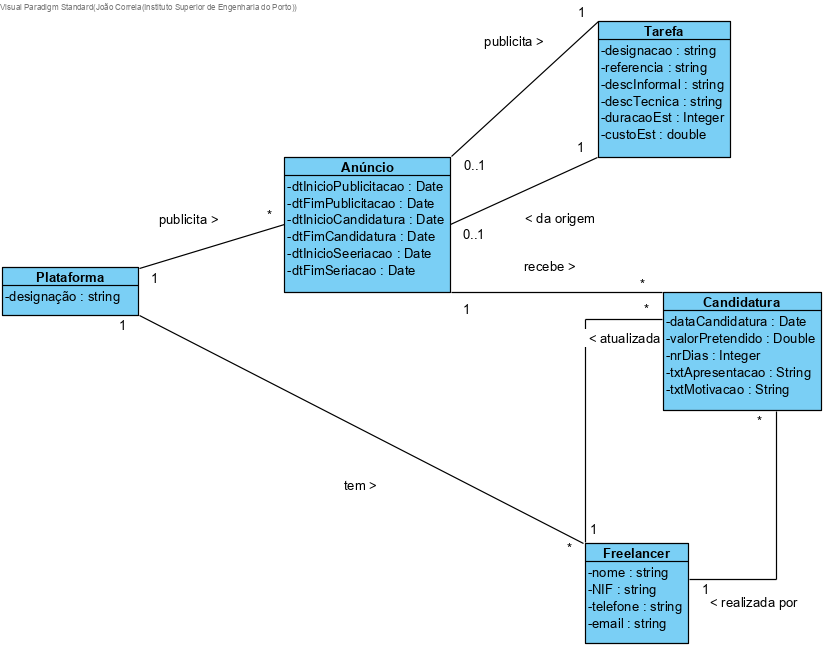
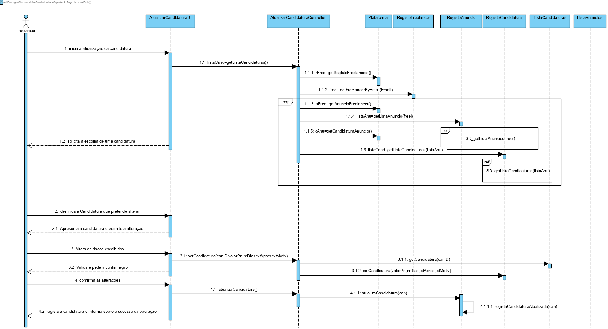
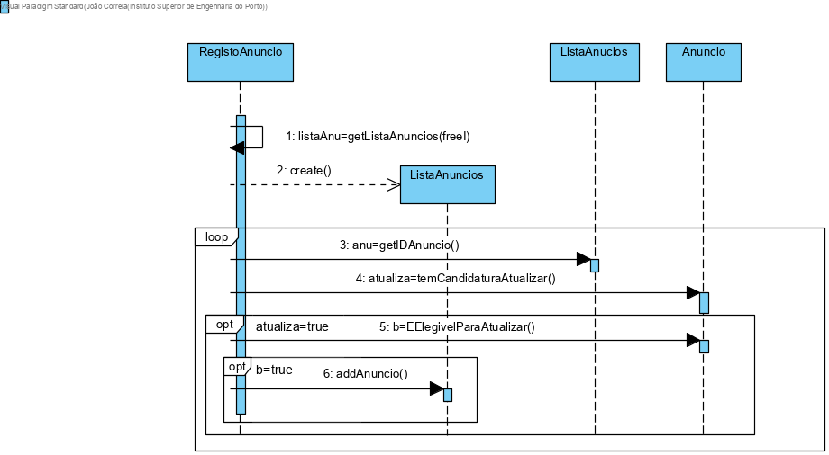
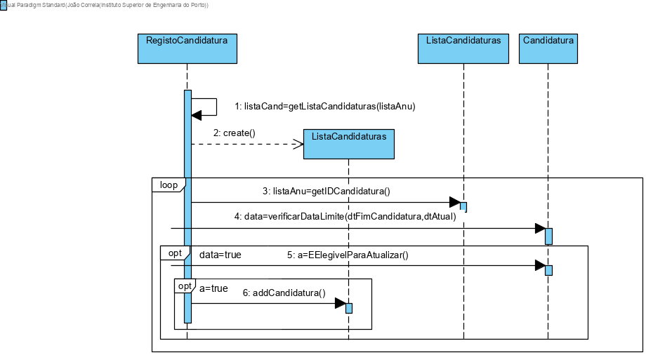
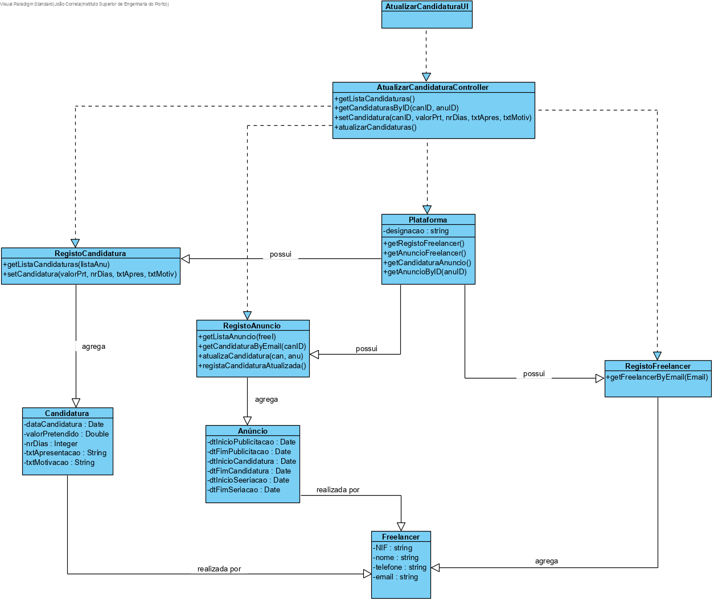

# UC11- Atualizar Candidatura

## 1. Engenharia de Requisitos

### Formato Breve
O Freelancer inicia atualização de um candidatura a um anúncio. O sistema solicita a escolha da candidatura que pretende atualizar. O Freelancer identifica a candidatura que pretende atualizar. O sistema solicita a escolha dos dados que o Freelancer pretende alterar. O freelancer realiza a escolha. 
O sistema solicita os dados escolhidos para a atualização da candidatura ao anúncio (exemplos(i.e. valor pretendido, numero dias, texto apresentacão (opcional), texto motivação (opcional))). O Freelancer introduz os dados solicitados. O sistema valida e apresenta os dados ao Freelancer e pede a sua confirmação. O Freelancer confirma os dados. O sistema regista a atualização de uma candidatura ao anúncio e informa o Freelancer do sucesso da operação.

### SSD

### Formato Completo

#### Ator principal

Freelancer

#### Partes interessadas e seus interesses

* **Freelancers:** pretende alterar a sua Candidatura.
* **Organização:** pretende receber a Candidatura atualiza para as Tarefas publicadas para a execução por Freelancers.
* **Colaborador de Organização:** pretende que as Candidaturas sejam atualizadas.

#### Pré-condições
Existir uma Candidatura para atualizar.
O Freelancer tem que ter o grau de proficiência mínimo exigido para essa candidatura.

#### Pós-condições
Atualizada uma Candidatura em um Anúncio.

#### Cenário de sucesso principal (ou fluxo básico)

	1.O Freelancer inicia a atualização de uma candidatura a um anúncio
	2.O sistema solicita a escolha de uma candidatura de uma lista de candidaturas já realizadas e possiveis para a sua alteração.
	3.O Freelancer identifica a candidatura que pretende alterar.
	4.O sistema apresenta a candidatura e permite a alteração dos dados.
	5.O Freelancer altera os dados escolhidos.
	6.O sitema valida e pede a confirmação do Freelancer.
	7.O Freelancer confirma as alterações.
	8.O sistema regista a candidatura atualizada e informa o Freelancer do sucesso da operação.

#### Extensões (ou fluxos alternativos)

a. O Freelancer solicita o cancelamento da atualização da candidatura.
	>1a.O caso de uso termina.

2a. Não existem Candidaturas para serem atualizadas.
	>1.O caso de uso termina.

4a. O Freelancer não escolhe nenhum dados para alterar.
	>1.O caso de uso termina.

4b. Dados mínimos obrigatórios em falta.
	>1.O sistema informa quais os dados em fala.
	>2.O sistema permite a introdução dos dados em falta (passo 4).
		>1.O Freelancer não altera os dados.O caso de uso termina.

4c.O sistema deteta que os dados introduzidos(ou algum subconjunto dos dados) são inválidos.
	>1.O sistema alerta o Freelancer para o facto.
	>2.O sistema permite a sua alteração (passo 4).
		>1.O Freelancer nao altera os dados. O caso de uso termina.

#### Requisitos especiais

\-

#### Lista de Variações de Tecnologias e Dados

\-

#### Frequência de Ocorrência

\-

#### Questões em aberto

•	O Freelancer pretende atualizar toda a candidatura ou só uma parte especifica?

•	A candidatura pode ser alterada fora do prazo?

• 	Qual é a freqência da realização deste caso de uso?

## 2. Análise OO

### Excerto do Modelo de Domínio Relevante para o UC

## 3. Design - Realização do Caso de Uso

### Racional

| Fluxo Principal | Questão: Que Classe... | Resposta  | Justificação  |
|:--------------  |:---------------------- |:----------|:---------------------------- |
|1.O Freelancer inicia a atualização de uma candidatura a um anúncio | ...interage com o utilizador? | AtualizarCandidaturaUI | Pure Fabrication |
|| ...cordena o UC? | AtualizarCandidaturaCantroller | Controller |
|| cria instância de Candidatura? | Anúncio | Creator (Regra1): no MD o Anúncio recebe Candidaturas |
||| ListaCandidaturas | IE: no MD o Anúncio recebe Candidaturas. Por aplicação de HC+LC delega a ListaCandidaturas |
|| ...conhece o utilizador/Freelancer a usar o sistema? | RegistoFreelancer | IE: decomentação do componente de gestão de utilizadores |
|| ...conhece o Freelancer? | Plataforma | conhece todos os Freelancers |
|2.O sistema solicita a escolha de uma candidatura de uma lista de candidaturas já realizadas e possiveis para a sua alteração. | ...conhece as candidaturas? | Anúncio | Ie: no MD o Anúncio possui as Candidaturas |
|| RegistoAnuncio | IE: O Anúncio possui as Identificações dos Anúncios. Por aplicação de HC+LC delega RegistoAnuncio |
|| RegistoCandidatura | IE: A Candidatura possui as identificações das Candidaturas. Por aplicação de HC+LC delega RegistoCandidaturas | 
|3.O Freelancer identifica a candidatura que pretende alterar.||||
|4.O sistema apresenta a candidatura e permite a alteração dos dados.||||
|5.O Freelancer altera os dados escolhidos. | ...guarda os dados introduzidos? | Anúncio | No MD Anúncio recebe Candidaturas |
|| ListaCandidaturas | por aplicação de HC+LC delega a ListaCandidaturas |
|| Candidatura | IE: Candidatura conhece os seus dados |
|6.O sitema valida e pede a confirmação do Freelancer. | ...valida os dados da Candidatura (validação local)? | Candidatura | IE: posssui os seus próprios dados. |
|| ...valida os dados da Candidatura (validação global)? | ListaCandidaturas | IE: no MD o Anúncio recebe Candidaturas. Por aplicação de HC+LC delega a ListaCandidaturas |
|7.O Freelancer confirma as alterações.|||
|8.O sistema regista a candidatura atualizada e informa o Freelancer do sucesso da operação. | ...guarda os Anuncios? | ListaAnuncio | Por aplicação de HC+LC delega a ListaAnuncio |
|| ListasCandidaturas | IE: no MD o Anúncio recebe Candidaturas. Por aplicação dee HC+LC delega a ListaCandidaturas.

### Sistematização ##

 Do racional resulta que as classes conceptuais promovidas a classes de software são:

 * Plataforma;
 * Candidatura;
 * Anúncios;  

Outras classes de software (i.e. Pure Fabrication) identificadas:  

 * AtualizarCandidaturaUI;
 * AtualizarCandidaturaController;
 * RegistoCandidaturas;  
 * RegistoAnuncios;
 * ListaCandidaturas;
 * ListaAnuncio;

Outras classes de sistemas/componentes externos:
 * RegistoFreelancer;

###	Diagrama de Sequência

###	Diagrama de Classes

