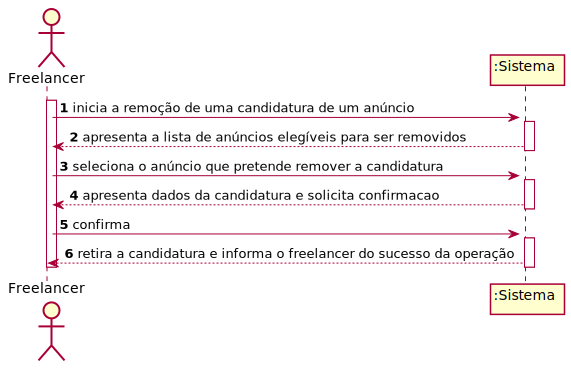
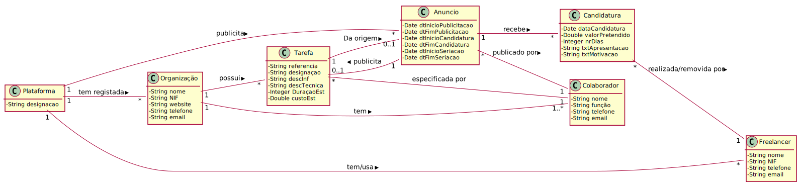
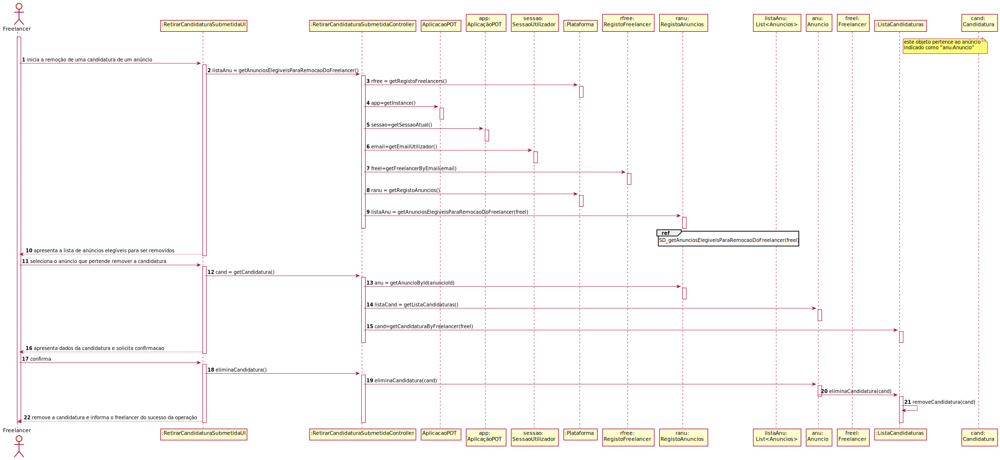
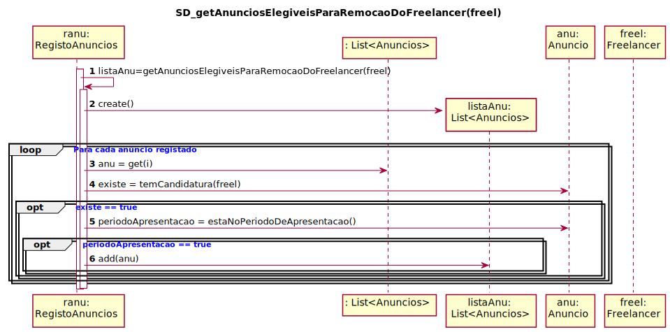
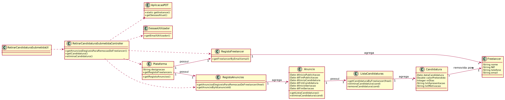

# UC 12 - Retirar Candidatura

## 1. Engenharia de Requisitos

### Formato Breve

O Freelancer inicia a remoção de uma candidatura de um anúncio. O sistema apresenta a lista de anúncios elegíveis para ser removidos. O Freelancer seleciona o anúncio que pretende remover a candidatura. O sistema apresenta dados da candidatura e solicita confirmacao. O Freelancer confirma. O sistema retira a candidatura ao anúncio e informa o Freelancer do sucesso da operação.

### SSD

### Formato Completo

#### Ator principal

 * Freelancer

#### Partes interessadas e seus interesses

* **Freelancer:** pretende conhecer os Anúncios a que se candidatou e retirar a sua candidatura.
* **Organização:** pretende retirar candidaturas para as Tarefas publicadas para execução por Freelancers.
* **T4J:** pretende retirar candidaturas para posterior atribuição das tarefas a Freelancers.

#### Pré-condições

* O freelancer deve ter candidaturas submetidas no anúncio.

#### Pós-condições

* É retirada a candidatura a um anúncio posteriormente submetida pelo freelancer.

#### Cenário de sucesso principal (ou fluxo básico)

1. O Freelancer inicia a remoção de uma candidatura de um anúncio.
2. O sistema apresenta a lista de anúncios elegíveis para ser removidos.
3. O Freelancer seleciona o anúncio que pretende remover a candidatura.
4. O sistema apresenta dados da candidatura e solicita confirmacao.
5. O Freelancer confirma.
6. O sistema retira a candidatura ao anúncio e informa o Freelancer do sucesso da operação.

#### Extensões (ou fluxos alternativos)

*a. O Freelancer solicita o cancelamento do processo de retirar a candidatura ao anúncio.
> O caso de uso termina.

2a. Não existem anúncios em que o freelancer efectuou a candidatura.
> O caso de uso termina.

#### Requisitos especiais

\-

#### Lista de Variações de Tecnologias e Dados

\-

#### Frequência de Ocorrência

\-

#### Questões em aberto

* O Freelancer pode selecionar mais do que um anúncio?
* Depois de retirar uma candidatura, o Freelancer pode voltar a ter acesso a mesma?
* A candidatura pode ser retirada fora do prazo (i.e. período de candidatura)?

## 2. Análise OO

### Excerto do Modelo de Domínio Relevante para o UC

## 3. Design - Realização do Caso de Uso

### Racional

| Fluxo Principal | Questão: Que Classe... | Resposta  | Justificação  |
|:--------------  |:---------------------- |:----------|:---------------------------- |
|1. O Freelancer inicia a remoção de uma candidatura de um anúncio.| ... interage com o utilizador?| RetirarCandidaturaUI  | Pure Fabrication  |
| |...coordena o UC? | RetirarCandidaturaController | Controller  |
| |...cria instância de RetirarCandidatura? | Candidatura | Creator (Regra1): no MD a candidatura recebe retirarCandidatura |
|  |	| ListaRetirarCandidatura | IE: no MD a candidatura recebe retirarCandidatura. Por aplicação de HC+LC delega a ListaRetirarCandidatura |
 | |	...conhece o utilizador/Freelancer a usar o sistema? | SessaoUtilizador | IE: cf. documentação do componente de gestão de utilizadores. |
| |	...conhece o Freelancer ? | Plataforma |conhece todos os Freelancers |
| |				|RegistoFreelancer|Por aplicação de HC+LC delega a RegistoFreelancer|
| 2. O sistema apresenta a lista de anúncios elegíveis para ser removidos. |... conhece as anuncios? | Plataforma |IE: no MD a Plataforma possui Anúncios. |
| | 						     | RegistoAnuncios	|IE: no MD a Plataforma possui Anuncios. Por aplicação de HC+LC delega a RegistoAnuncios|
| |...conhece os Anúncios a que o Freelancer se candidatou | Freelancer	| O Freelancer possui Reconhecimentos de Candidaturas | IE |  
| 3. O Freelancer seleciona o anúncio que pretende remover a candidatura. | | | |
| 4. O sistema apresenta dados da candidatura e solicita confirmacao.|	... valida os dados de retirarCandidatura (validação local)?| RetirarCandidatura | IE: possui os seus próprios dados.|
| |	... valida os dados de retirarCandidatura (validação global)?| ListaRetirarCandidatura | IE: no MD o Anúncio recebe Candidaturas. Por aplicação de HC+LC delega a ListaRetirarCandidatura |
| 5. O Freelancer confirma. | N/A|||
| 6. O sistema retira a candidatura ao anúncio e informa o Freelancer do sucesso da operação. |...retira a Candidatura? | Anúncio |IE: no MD o Anúncio recebe Candidaturas.|
| |							| ListaRetirarCandidatura | IE: no MD o Anúncio recebe Candidaturas. Por aplicação de HC+LC delega a ListaRetirarCandidatura |

### Sistematização ##

 Do racional resulta que as classes conceptuais promovidas a classes de software são:

 * Plataforma
 * Candidatura
 * Freelancer
 * Anuncio
 * Tarefas
 * Organização

Outras classes de software (i.e. Pure Fabrication) identificadas:  

 * RetirarCandidaturaUI  
 * RetirarCandidaturaController
 * RegistoAnuncios
 * RegistoFreelancer
 * ListaRetirarCandidatura

###	Diagrama de Sequência

###	Diagrama de Classes

