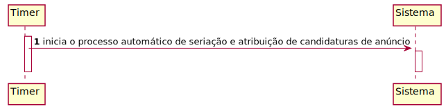
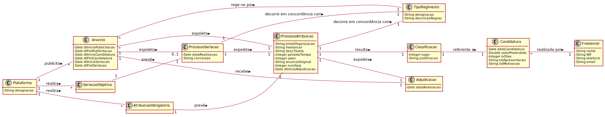
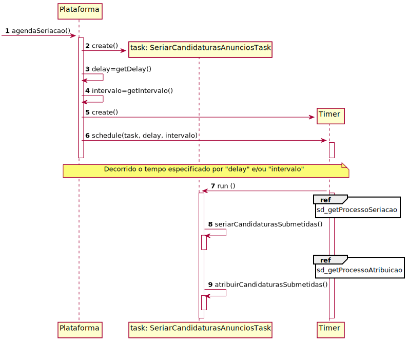
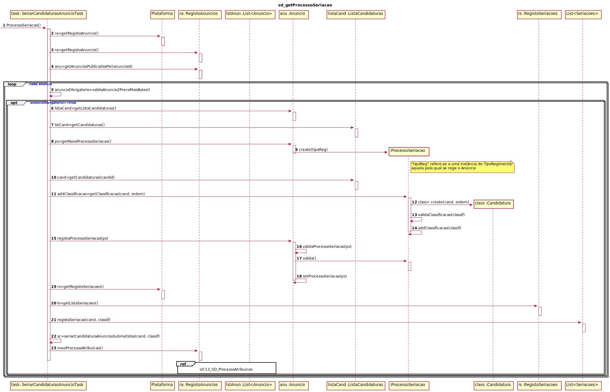
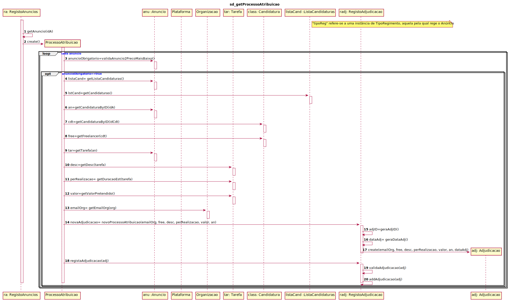
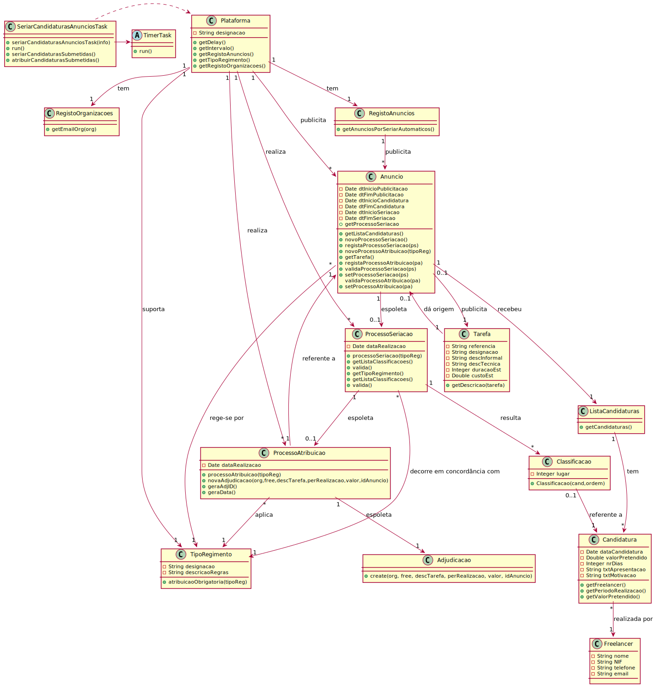

# UC13- Seriar (automaticamente) Candidaturas de Anúncios

## 1. Engenharia de Requisitos

### Formato Breve
O Timer inicia o processo automático de seriação (e.g. às 02h15m de cada dia) e atribuição de candidaturas de anúncio em período de seriação e atribuição. 

### SSD

### Formato Completo

#### Ator principal

Timer.

#### Partes interessadas e seus interesses

* **Colaborador de Organização:** pretende seriar automaticamente as candidaturas que um anúncion recebeu quando o tipo de regimento do mesmo assenta em critérios subjetivos.
* **Freelancer:** pretende conhecer a classificação das suas candidaturas à realização de determinados anúncios publicados na plataforma quando o tipo de regimento do mesmo assenta em critérios subjetivos.
* **Organização:** pretende precaver-se contra eventuais situações de falha de comunicação entre o processo automático de seriação dos candidatos à realização de anúncios e o sistema. 
* **T4J:** pretende que o processo de seriação de um anúncio seja automático quando o tipo de regimento do mesmo assenta em critérios objetivos.

#### Pré-condições
Existir pelo menos um anúncio de tarefa em condições de ser seriado automaticamente pelo sistema.

#### Pós-condições
Fica registada a atribuição e a seriação automática.

#### Cenário de sucesso principal (ou fluxo básico)

1.	O Timer inicia o processo de seriação automático dentro dos critérios (seriação objetiva, em período de seriação e não seriados).
2.	O sistema identifica os anúncios cujo tipo de regimento estipula que os critérios de seriação sejam objetivos (e.g. 2º preço mais baixo), que estejam no período de seriação e que ainda não tenham sido seriados. Caso o processo de atribuição do anúncio seja obrigatório, então o caso de uso terá continuidade. 

#### Extensões (ou fluxos alternativos)

1a.Não existe nenhum anúncio cujo tipo de regimento estipula que os critérios de seriação sejam objetivos. 
O caso de uso termina.

1b. Não existe nenhum anúncio que esteja no período de seriação.
1. O caso de uso termina.

1c. Não existe nenhum anúncio que ainda não tenha sido seriado.
1. O caso de uso termina.

#### Requisitos especiais

\-

#### Lista de Variações de Tecnologias e Dados

\-

#### Frequência de Ocorrência

\-

#### Questões em aberto

•O mesmo lugar/classificação pode ser atribuído a mais do que uma candidatura (e.g. em caso de empate)?
•Há algum motivo que possa levar à desclassificação de uma candidatura?

## 2. Análise OO

### Excerto do Modelo de Domínio Relevante para o UC

## 3. Design - Realização do Caso de Uso

### Racional

| Fluxo Principal | Questão: Que Classe... | Resposta  | Justificação  |
|:--------------  |:---------------------- |:----------|:---------------------------- |
| 1. O Timer inicia o processo de seriação automático dentro dos critérios (seriação objetiva, em período de seriação e não seriados).  		 |	...configura o Timer?  | Plataforma | IE: conhece toda a informação necessária.|
| 2. O sistema identifica os anúncios cujo tipo de regimento estipula que os critérios de seriação sejam objetivos (e.g. 2º preço mais baixo), que estejam no período de seriação e que ainda não tenham sido seriados. Caso o processo de atribuição do anúncio seja obrigatório, então o caso de uso terá continuidade. | ...conhece todos os anúncios?	   | RegistoAnuncios             |   IE + padrão LC+HC: A Plataforma publicita anúncios, no MD, mas delega as responsabilidades na classe RegistoAnuncios.|
|| ...guarda os dados da seriação?|ProcessoSeriacao|IE:conhece os seus próprios dados|
|| ...cria a instância ProcessoSeriacao?|Anuncio|Creator(Regra 1): no MD o Anuncio espoleta ProcessoSeriacao| 
|| ...guarda os dados da atribuição?|ProcessoAtribuicao|IE:conhece os seus próprios dados|
|| ...cria a instância ProcessoAtribuicao?|Anuncio|Creator(Regra 1): no MD o Anuncio espoleta ProcessoAtribuicao|
|| ...prevê o ProcessoSeriacao? | SeriacaoObjetiva |Por aplicação de HC+LC delega SeriacaoObjetiva|
|| ...prevê o ProcessoAtribuicao? | AtribuicaoObrigatoria|Por aplicação de HC+LC delega AtribuicaoObrigatoria |
|| ...conhece as candidaturas que o anúncio recebe? | ListaCandidaturas | IE+ padrão HC+LC: pois no MD a classe Anuncio espoleta ProcessoAtribuicao que resulta em Classificacao e que recebe Candidatura, no entanto delega as responsabilidades na classe "ListaCandidaturas"|
|| ...conhece os dados da candidatura? | Candidatura | IE:conhece os seus próprios dados. |
|| ...conhece o tipo de regimento que é aplicável?|TipoRegimento|IE+ padrao HC+LC: no MD, Plataforma publicita Anuncio que se rege por TipoRegimento, mas delega as responsabilidades na classe "TiposRegimento" |
|| ...conhece as regras de seriacao do anúncio?|TipoRegimento|IE:conhece os seus próprios dados|
|| ...conhece a tarefa a adjudicar?|Anuncio|IE:no MD Anuncio recebe Adjudicacao| 

### Sistematização ##

 Do racional resulta que as classes conceptuais promovidas a classes de software são:

 * Plataforma;
 * Anuncio;
 * ProcessoAtribuicao;
 * ProcessoSeriacao;
 * Adjudicacao;
 * Candidatura;
 * Classificacao;

Outras classes de software (i.e. Pure Fabrication) identificadas:  

 * RegistoAnuncios;  
 * SeriacaoObjetiva;
 * AtribuicaoObrigatoria;
 * ListaCandidaturas;
 * TipoRegimento;

###	Diagrama de Sequência

###	Diagrama de Classes

