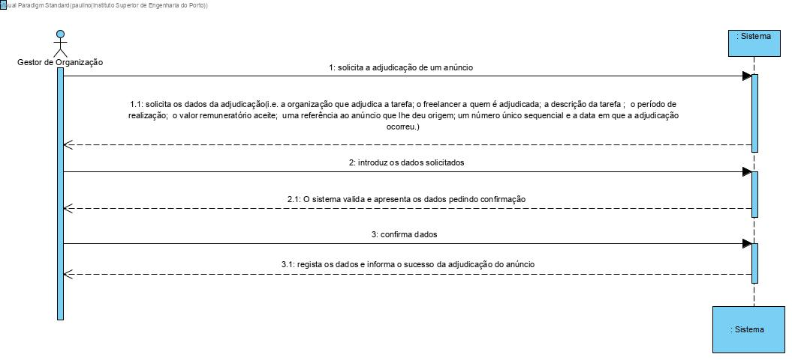
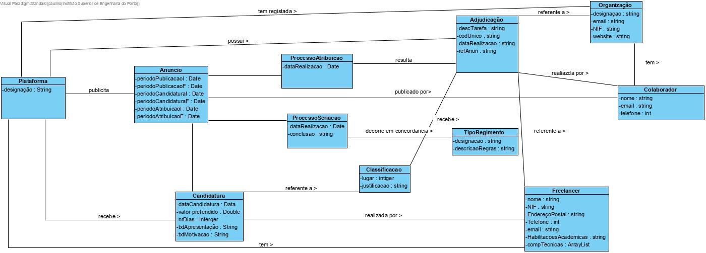
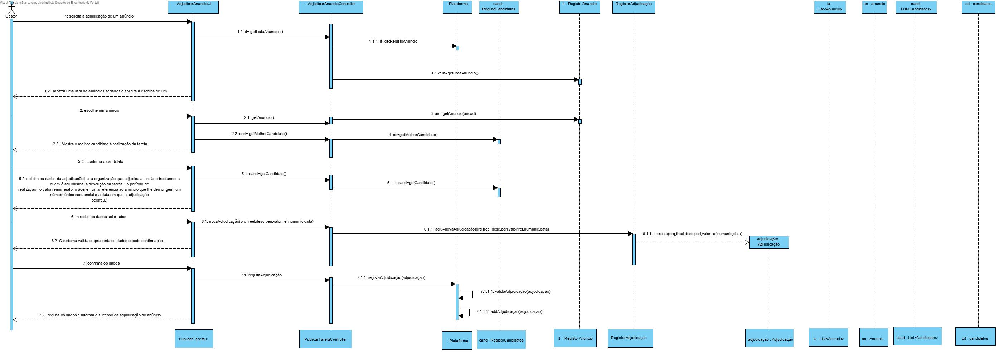
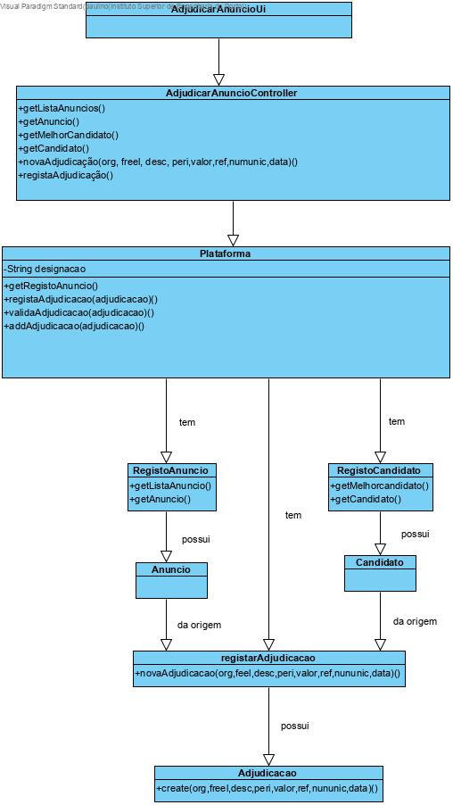

# UC14 - Atribuir Anuncio

## 1. Engenharia de Requisitos

### Formato Breve

Solicita a adjudicação de um anúncio
Solicita os dados da adjudicação(i.e. a organização que adjudica a tarefa; o freelancer a quem é adjudicada; a descrição da tarefa ;  o período de realização;  o valor remuneratório aceite;  uma referência ao anúncio que lhe deu origem; um número único sequencial e a data em que a adjudicação ocorreu.)
Introduz os dados solicitados
O sistema valida e apresenta os dados pedindo confirmação
Confirma dados 
Regista os dados e informa o sucesso da adjudicação do anúncio 

### SSD

### Formato Completo

#### Ator principal

* Gestor da organização

#### Partes interessadas e seus interesses

* **Organização:** pretende atribuir um anuncio.
* **T4J:** pretende que a plataforma permite atribuir anuncio a um freelancer.

#### Pré-condições
* UC10

#### Pós-condições
* Freelancer ficou com um anúncio .

### Cenário de sucesso principal (ou fluxo básico)

1.Solicita a adjudicação de um anúncio
2.Mostra uma lista de anúncios seriados e solicita a escolha de um
3.Escolhe um anúncio
4.Mostra o melhor candidato à realização da tarefa 
5.Confirma o candidato
6.solicita os dados da adjudicação(i.e. a organização que adjudica a tarefa; o freelancer a quem é adjudicada; a descrição da tarefa ;  o período de realização;  o valor remuneratório aceite por ambas as partes ;  uma referência ao anúncio que lhe deu origem; um número único sequencial e a data em que a adjudicação ocorreu.)
7.Introduz os dados solicitados
8.O sistema valida e apresenta os dados pedindo confirmação
9.Confirma dados 
10.Regista os dados e informa o sucesso da adjudicação do anúncio

#### Extensões (ou fluxos alternativos)

*a. O Colaborador solicita o cancelamento da publicaçao do anuncio.  
> O caso de uso termina.

2a. Não existe anuncio definida no sistema.  
>1. O sistema informa o administrativo de tal facto.  
>2. O sistema permite a criação de uma nova tarefa . 
 
> 2a. O Colaborador não cria uma tarefa. O caso de uso termina.

8a. Dados do codigo incompletos.
>1-O sistema informa quais os dados em falta.
>2-O sistema permite a introdução dos dados em falta.

>  2a. O utilizador não registado não altera os dados. O caso de uso termina.

8b.Dados mínimos obrigatórios em falta.
>1-O sistema informa quais os dados em falta.
>2-O sistema permite a introdução dos dados em falta.

> 2a. O utilizador não registado não altera os dados. O caso de uso termina.

8c. O sistema deteta que os dados (ou algum subconjunto dos dados) introduzidos devem ser únicos e que já existem no sistema.

>1-O sistema alerta o utilizador não registado para o facto.
>2-O sistema permite a sua alteração (passo 3)

> 2a. O utilizador não registado não altera os dados. O caso de uso termina. 

8d. O sistema deteta que os dados introduzidos não correspondem ao formato de dados pretendidos.

>1-O sistema informa quais os dados em que estão no formato diferente.
>2-O sistema permite a introdução desses dados.
 
> 2a. O utilizador não registado nao altera os dados. caso de uso termina.

#### Requisitos especiais
\-

#### Lista de Variações de Tecnologias e Dados
\-

#### Frequência de Ocorrência
\-

#### Questões em aberto

## 2. Análise OO

### Excerto do Modelo de Domínio Relevante para o UC

## 3. Design - Realização do Caso de Uso

### Racional

| Fluxo Principal | Questão: Que Classe... | Resposta  | Justificação  |
|:--------------  |:---------------------- |:----------|:---------------------------- |
| 1: inicio da adjudicação de um anúncio  |	... interage com o utilizador? |  AdjudicarAnuncioUi |  Pure Fabrication: não se justifica atribuir esta responsabilidade a nenhuma classe existente no Modelo de Domínio. |
|  		 |	... coordena o UC?	| AdjudicarAnuncioController | Controller    |
|  		 |	... cria instância de Anuncio? | RegistarAnuncio   | HC/Creator  |
| 2.  Mostra uma lista de anúncios seriados e solicita a escolha de um  		 |	conhece o anuncio	   |      RegistarAnuncio     |   IE/HC |
| 3. Escolhe um anúncio  		 |	... guarda o anuncio selecionado?  |   Adjudicacao|     |
| 4.Mostra o melhor candidato à realização da tarefa   		 |	... conhece os candidatos  |  RegistoCandidatos |                 IE/HC       |
| 5. Confirma o candidato | 	| 		|                      |
| 6.solicita os dados da adjudicação(i.e. a organização que adjudica a tarefa; o freelancer a quem é adjudicada; a descrição da tarefa ;  o período de realização;  o valor remuneratório aceite por ambas as partes ;  uma referência ao anúncio que lhe deu origem; um número único sequencial e a data em que a adjudicação ocorreu.)   		 |	 | 	 |     |  	
| 7. Introduz os dados solicitados   		 |... guarda os dados introduzidos		Adjudicacao	 |  information Expert           |
| 8. O sistema valida e apresenta os dados e pede confirmação.  		 |	...valida os do anuncio | Anuncio | IE: Possi os seus proprios dados |  
| 9. Confirma.  		 |			 | 			  | 				 |  
| 10. Regista os dados e informa o sucesso da adjudicação do anúncio  		 |	... guarda a adjudicacao criado? | RegistarAdjudicacao  |  High cohesion e low Coupling |  

### Sistematização ##

 Do racional resulta que as classes conceptuais promovidas a classes de software são:

 * Plataforma
 * Adjudicação
 * Organização

Outras classes de software (i.e. Pure Fabrication) identificadas:  

 * PublicarTarefaUI  
 * PublicarTarefaController
 * RegistoAdjudicacao
 * RegistoCandidato
 * RegistoAnuncio
 * ListaAnuncios
 * ListaColaboradores 

###	Diagrama de Sequência

###	Diagrama de Classes

