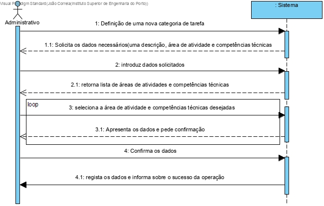
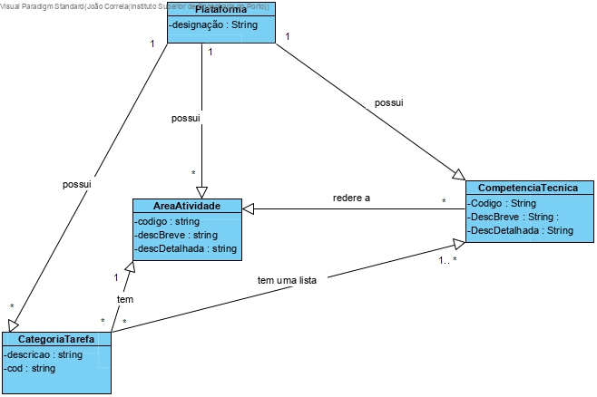
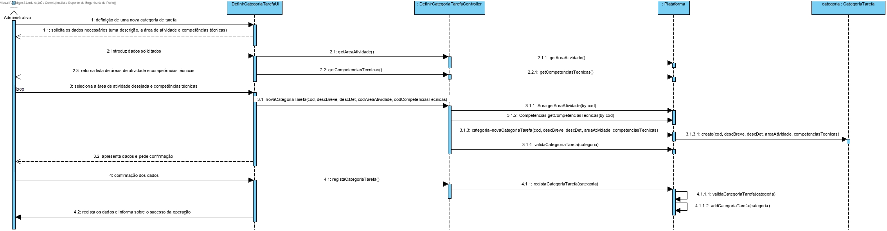
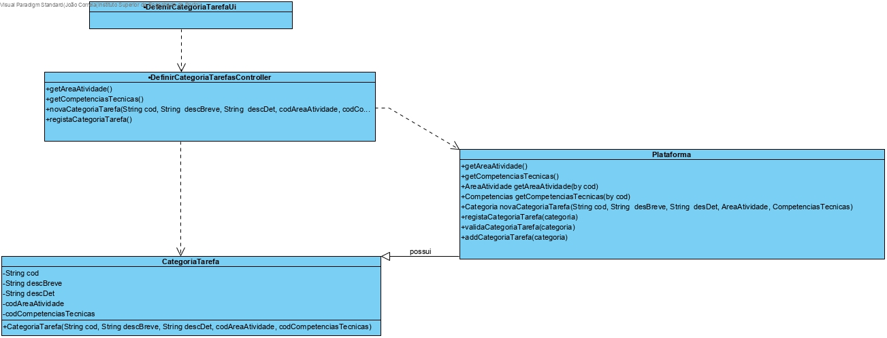

# UC3 - Definir Categoria (de Tarefa)

## 1. Engenharia de Requisitos

### Formato Breve

O administrativo inicia a defenição de uma nova categoria de tarefa.O sistema solicita os dados necessários (uma descrição, a área de atividade em que se enquadra e uma lista de competência técnicas). O administrativo introduz os dados solicitados. O sistema valida e apresenta os dados ao administrativo, pedindo que os confirme. O administrativo confirma. O sistema regista os dados e informa o administrativo do sucesso da operação.

### SSD

### Formato Completo

#### Ator principal

Administrativo

#### Partes interessadas e seus interesses

* **Administrativo:** pretende definir as áreas de atividade para que possa posteriormente catalogar as competências técnicas e categorias de tarefas.
* **T4J:** pretende que a plataforma permita catalogar as competências técnicas e as categorias de tarefas em áreas de atividade.

#### Pré-condições
Estar autenticado como administrativo.

#### Pós-condições
A informação da categoria de tarefa é guardada no sistema.

#### Cenário de sucesso principal (ou fluxo básico)

1. O administrativo inicia a definição de uma nova categoria de tarefa.   
2. O sistema solicita os dados necessários ( descrição, área de atividade e competências técnicas).
3. O administrativo introduz os dados solicitados.
4.O sistema retorna a lista da área de tarefas e das competências técnicas.
5. O administrativo seleciona a área de atividade e competências técnicas.
6.  O sistema apresenta os dados e pede confirmação.
7.  O administrativo confirma.
8. O sistema regista os dados e informa o administrativo do sucesso da operação.

#### Extensões (ou fluxos alternativos)

*a. O Administrativo solicita o cancelamento da definição da categoria.

> O caso de uso termina.

3a. O sistema informa que o administrador tem a pocibilidade selecionar outra área de atividade.
>	1. O sistema alerta o administrativo para o facto.
>	2. O sistema permite a introdução dos dados em falta (passo 3)
>
	>	2a. O Administrativo não altera os dados. O caso de uso termina.

3b. O sistema informa que o administrador tem a pocibilidade selecionar outra competência técnica.
>	1. O sistema alerta o administrativo para o facto.
>	2. O sistema permite a introdução dos dados em falta (passo 3)
>
	>	2a. O Administrativo não altera os dados. O caso de uso termina.

4a. Dados mínimos obrigatórios em falta.
> 	1. O sistema informa quais os dados em falta.
> 	2. O sistema permite a introdução dos dados em falta (passo 3)
> 		2a. O administrativo não altera os dados. O caso de uso termina. 

4b. O sistema deteta que os dados (ou algum subconjunto dos dados) introduzidos devem ser únicos e que já existem no sistema.

>	1.O sistema alerta o administrativo para o facto.
>	2.O sistema permite a sua alteração (passo 3)

>		2a. O administrativo não altera os dados. O caso de uso termina. 
 
4c. O sistema detecta que os dados introduzidos (ou algum subconjunto dos dados) são inválidos.

>	1.O sistema alerta o administrativo para o facto.
>	2.O sistema permite a sua alteração (passo 3).

>		2a. O administrativo não altera os dados. O caso de uso termina. 

#### Requisitos especiais
-

#### Lista de Variações de Tecnologias e Dados
-

#### Frequência de Ocorrência
-

#### Questões em aberto

1. Qual a frequência de ocorrência deste caso de uso?
2. Existem outros dados obrigatórios?
3. Quais os dados que em conjunto permitem detetar a duplicação de categorias?

(lista de questões em aberto, i.e. sem uma resposta conhecida.)

## 2. Análise OO

### Excerto do Modelo de Domínio Relevante para o UC

## 3. Design - Realização do Caso de Uso

### Racional

| Fluxo Principal | Questão: Que Classe... | Resposta  | Justificação  |
|:--------------  |:---------------------- |:----------|:---------------------------- |
| 1. O Administrativo pretende definir uma categoria de tarefa.		 | ... interage com o utilizador?							 |     DefinirCategoriaUI        |      Pure Fabrication, pois não se justifica atribuir esta responsabilidade a nenhuma classe existe no Modelo de Domínio.      |
||... coordena o UC?| DefinirCategoriaController | Controller |
||... cria instância de CategoriaTarefa | Plataforma | Creator |
|2. O sistema solicita os dados sobre a categoria (descrição, área de atividade, lista de competências técnicas).||||
|3. O Administrativo introduz dados solicitados. | ... guarda os dados introduzidos? | CategoriaTarefa | IE - instância criada no passo 3 |
| 4. O sistema valida e apresenta os dados ao administrativo, pedindo que os confirme. | ... valida os dados (validação local) | CategoriaTarefa | IE: CategoriaTarefa possui os próprios dados. |
||... valida os dados (validação global)? | Plataforma | IE: Plataforma possui as Categorias de Tarefa |
| 5. O Administrativo confirma. ||||
|6. O sistema regista os dados e informa o administrativo do sucesso da operação. | ...guarda a CategoriaDeTarefa criada? | Plataforma | IE: No MD a Plataforma possui CategoriaTarefa |

### Sistematização ##

 Do racional resulta que as classes conceptuais promovidas a classes de software são:

 * CompetenciaTecnica
 * AreaAtividade
 * CategoriaTarefa
 * Plataforma

Outras classes de software (i.e. Pure Fabrication) identificadas:  

 * DefinirCategoriaUI  
 * DefinirCategoriaController

### Diagrama de Sequência

 

### Diagrama de Classes

 
