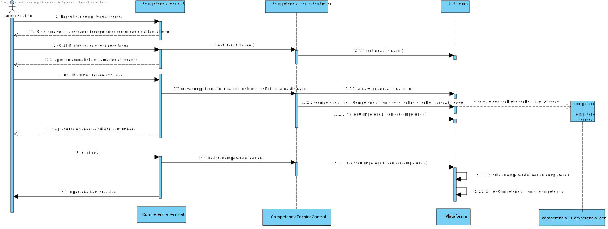

# UC4 - Especificar Competência Técnica

## 1. Engenharia de Requisitos

### Formato Breve

O administrativo faz abertura a uma nova competência técnica.
O sistema solicita os dados necessários (código unico e uma descrição breve e outra mais detalhada). O administrativo introduz os dados solicitados.O sistema apresenta uma lista com areas de atividades.O administrativo escolhe uma area de atividade. O sistema valida e apresenta os dados ao administrativo, pedindo que os confirme. O administrativo confirma. O sistema regista os dados e informa o administrativo do sucesso da operação. 

### SSD

### Formato Completo

#### Ator principal

Administrativo

#### Partes interessadas e seus interesses
* **Administrativo:** pretende especificar as competencia tecnicas .

#### Pré-condições
Area defenida na UC2

#### Pós-condições
A competência técnica é registada no sistema .

### Cenário de sucesso principal (ou fluxo básico)

1.O administrativo faz pedido para a criação de uma nova competência técnica .
2.O sistema solicita os dados necessários( código único e uma descrição breve e outra mais detalhada da respetiva competência).
3.O administrativo introduz os dados solicitados.
4.O sistema apresenta uma lista de areas de atividades para o administrativo escolher.
5.O administrativo escolha uma area de atividade. 
6.O sistema valida e apresenta os dados ao administrativo, pedindo que os confirme.
7.O administrativo confirma.
8.O sistema regista os dados e informa o administrativo do sucesso da operação.

#### Extensões (ou fluxos alternativos)

6a. Dados do codigo incompletos.
 1-O sistema informa quais os dados em falta.
 2-O sistema permite a introdução dos dados em falta.

   2a. O utilizador não registado não altera os dados. O caso de uso termina.

6b.Dados mínimos obrigatórios em falta.
 1-O sistema informa quais os dados em falta.
 2-O sistema permite a introdução dos dados em falta.

  2a. O utilizador não registado não altera os dados. O caso de uso termina.

6c. O sistema deteta que os dados (ou algum subconjunto dos dados) introduzidos devem ser únicos e que já existem no sistema.

 1-O sistema alerta o utilizador não registado para o facto.
 2-O sistema permite a sua alteração (passo 3)

  2a. O utilizador não registado não altera os dados. O caso de uso termina.  

#### Requisitos especiais
\-

#### Lista de Variações de Tecnologias e Dados
\-

#### Frequência de Ocorrência
\-

#### Questões em aberto

* Existem outros dados que são necessários?
* Todos os dados são obrigatórios?
* O código único é sempre introduzido pelo administrativo ou o sistema deve gerá-lo automaticamente?

## 2. Análise OO

### Excerto do Modelo de Domínio Relevante para o UC

## 3. Design - Realização do Caso de Uso

### Racional

| Fluxo Principal | Questão: Que Classe... | Resposta  | Justificação  |
|:--------------  |:---------------------- |:----------|:---------------------------- |
| 1. O administrativo faz pedido para a criação de uma nova competência técnica ..   		 |	... interage com o utilizador? | EspecificarCompetênciaUI    |  Pure Fabrication, pois não se justifica atribuir esta responsabilidade a nenhuma classe existe no Modelo de Domínio. |
|  		 |	... coordena o UC?	| EspecificarCompetênciaController | Controller    |
|  		 |	... cria instância de Competência Técnica| Plataforma   | Creator (Regra1)   |
| 2. O sistema solicita os dados necessários( código único e uma descrição breve e outra mais detalhada da respetiva competência).  		 |							 |             |                              |
| 3. O administrativo introduz os dados solicitados.  		 |	... guarda os dados introduzidos?  |   Competência Técnica | Information Expert (IE) - instância criada no passo 1 |
| 4. O sistema apresenta uma lista de áreas de atividades.   		 |	… apresenta a lista? | Plataforma|                              |
| 5. O administrativo seleciona uma área de atividade.   		 |	… guarda essa escolha?			 |             |                              |
| 6. O sistema regista os dados e informa o administrativo do sucesso da operação.  		 | ...valida os dados da Competência técnica(validação local)     |   Competência Técnica  |        |
|                                                                                                |...valida os dados da Competência técnica (validação global)|  Plataforma  |  IE: A Plataforma possui/agrega Competência técnica  |
| 7. O administrativo confirma. |    |       |     |
|8. O sistema regista os dados e informa o administrativo do sucesso da operação.| ... guarda a Competência técnica criada?   |  IE: No MD a Plataforma possui Competência técnica  |  IE: No MD a Plataforma possui Competência técnica      | 
             

### Sistematização ##

 Do racional resulta que as classes conceptuais promovidas a classes de software são:

 * Plataforma
 * Competencia : CompetenciaTecnica

Outras classes de software (i.e. Pure Fabrication) identificadas:  

 * DefenirCompetenciaTecnicaUi
 * DefenirCompetenciaTecnicaController

###	Diagrama de Sequência

###	Diagrama de Classes

