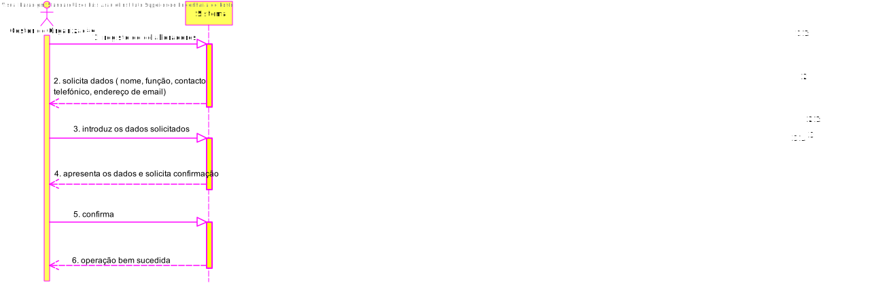
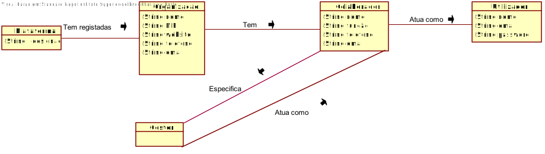
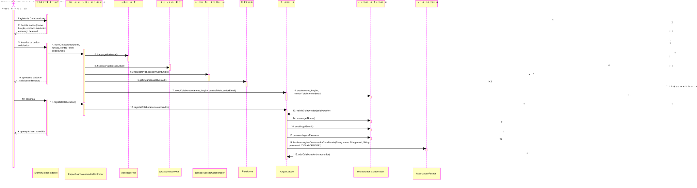
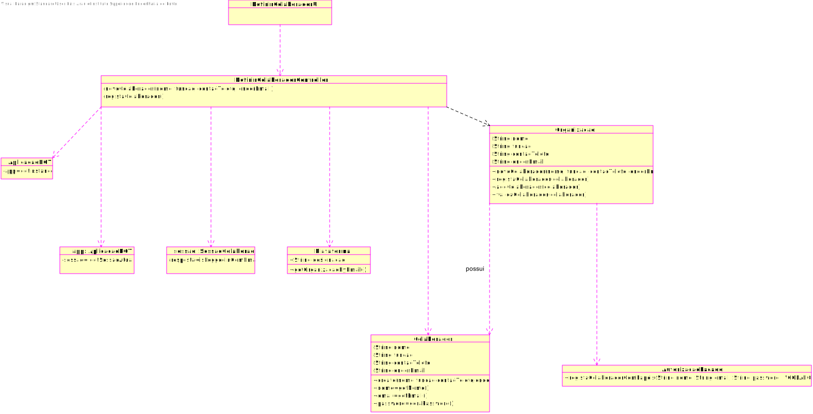

# UC5- Especificar Colaborador de Organização
## 1. Engenharia de Requisitos

### Formato Breve
O gestor de organização inicia o registo de outros colaboradores da organização. O sistema solicita os dados necessários (i.e. nome, função, contacto telefónico, endereço de email). O gestor de organização introduz os dados solicitados. O sistema valida e apresenta os dados ao gestor de organização, pedindo que os confirme. O gestor de organização confirma. O sistema regista os dados e informa o gestor de organização do sucesso da operação.

### SSD

### Formato Completo

#### Ator principal

Gestor de Organização

#### Partes interessadas e seus interesses

* **Gestor de Organização:** pretende especificar os colaboradores da organização e o seu registo na plataforma
* **Administrativo:** pretende saber do seu registo na plataforma como as especificações sobre si mesmo
* **Colaborador de Organização:**  pretende saber do seu registo na plataforma como as especificações sobre si mesmo

#### Pré-condições
n/a

#### Pós-condições
 A informação sobre os colaboradores é registada no sistema

#### Cenário de sucesso principal (ou fluxo básico)

1.	O gestor de organização inicia o registo dos colaboradores da organização.
2.	O sistema solicita os dados necessários (nome, função, contacto telefónico,
	endereço de email).
3.	O gestor de organização introduz os dados necessários.
4.	O sistema valida e apresenta os dados ao gestor de organização, pedindo que
	os confirme.
5.	O gestor de organização confirma.
6.	O sistema regista os dados e informa o gestor de organização do sucesso da
	operação.

#### Extensões (ou fluxos alternativos)

a. O Gestor solicita o cancelamento da especificação do colaborador da organização.
O caso de uso termina.

4a. Dados mínimos obrigatórios em falta.
1.	   O sistema informa quais os dados em falta.
2.	O sistema permite a introdução dos dados em falta (passo 3)
2a. O gestor de organização não altera os dados. O caso de uso termina.

4b. O sistema deteta que os dados (ou algum subconjunto dos dados) introduzidos
devem ser únicos e que já existem no sistema.
1.	O sistema alerta o administrativo para o facto.O sistema alerta o gestor de organização para o facto.
2.	O sistema permite a sua alteração (passo 3)
2a. O administrativo não altera os dados. O caso de uso termina.

4c. O sistema deteta que os dados introduzidos (ou algum subconjunto dos dados) são inválidos.
1.	O sistema alerta o administrativo para o facto.
2.	O sistema permite a sua alteração (passo 3).
2a. O gestor de organização não altera os dados. O caso de uso termina.

#### Requisitos especiais

\-

#### Lista de Variações de Tecnologias e Dados

\-

#### Frequência de Ocorrência

\-

#### Questões em aberto
•	Sendo que o gestor também é colaborador não pode ele também especificar a tarefa?

•	Existem outros dados necessários?

•	Todos os dados são obrigatórios?

• 	Qual a frequência de ocorrência deste caso de uso?

•	Quais os dados que em conjunto permitem detetar a duplicação de organizações (e de gestores)?

•	É necessário existir algum mecanismo de segurança adicional para confirmar que a
organização existe e é representada pela pessoa que a registou?

Gestor de Organização: pessoa indicada como gestor da organização aquando do
registo da organização na plataforma. Assume-se que é um colaborador dessa
organização, sendo responsável por especificar na plataforma outros
colaboradores dessa mesma organização;

## 2. Análise OO

### Excerto do Modelo de Domínio Relevante para o UC

## 3. Design - Realização do Caso de Uso

### Racional

| Fluxo Principal | Questão: Que Classe... | Resposta  | Justificação  |
|:--------------  |:---------------------- |:----------|:---------------------------- |
| 1. O Gestor de Organização inicia o registo de outros colaboradores da organização  		 |	...interage com o utilizador?  | DefinirColaboradorOrganizaçãoUI | Pure Fabrication|
||...coordena o UC?| EspecificarColaboradorController| Controller|
||...cria instância de Colaborador| Organização | Creator (regra 1)|					           
| 2. O sistema solicita os dados necessários (i.e. nome, função, contacto telefónico, endereço de email). 		 |			      |             |                              |
| 3. O gestor de organização introduz os dados solicitados  		 | guarda os dados introduzidos?							 |  Colaborador           |          Information Expert (IE) - instância criada no passo 1                     |
| 4. O sistema valida e apresenta os dados ao gestor de organização, pedindo que os confirme 		 |	...valida os dados do Colaborador(validação local) ... |Colaborador||
||valida os dados dos colaboradores(validação global)  		 |     Colaborador        |     IE: O Colaborador possui/agrega Colaborador|                     
| 5. O gestor de organização confirma 		 |							 |             |                              |
| 6.O sistema regista os dados e informa o gestor de organização do sucesso da operação 		 |		...guarda o ColaboradorOrganização criado?					 |     Plataforma        |   IE: No MD a Plataforma possui ColaboradorOrganização |        
 |	...guarda o utilizador referente ao Colaborador? | AutorizaçãoFacade | |    

### Sistematização ##

 Do racional resulta que as classes conceptuais promovidas a classes de software são:

 * Plataforma;
 * Colaborador;
 * Organização.

Outras classes de software (i.e. Pure Fabrication) identificadas:  

 * DefinirColaboradorUI  
 * EspecificarColaboradorController

###	Diagrama de Sequência

###	Diagrama de Classes

