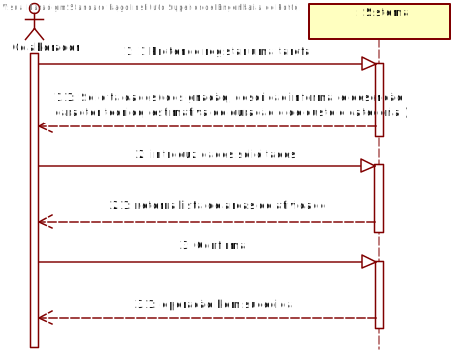

# UC6 Colaborador da organização - Especificar Tarefa

## 1. Engenharia de Requisitos

### Formato Breve

 O colaborador inicia o registo de uma tarefa , o sistema solicita os dados necessários (i.e. uma descrição a área de	atividade em que se	enquadra, a referência da tarefa, uma
 designação,	uma	descrição	informal e	outra	de	carácter	técnico, lista	de competência
 técnicas requeridas	para a realização	da tarefa e	uma	estimativa de duração e custo ,bem
 como a categoria em que a	mesma	se	enquadra). O colaborador introduz os dados solicitados e
 o sistema valida e apresenta os dados, pedindo que os confirme para a publicação. O colaborador confirma. O sistema publica a tarefa e informa o colaborador do sucesso da operação.

### SSD

### Formato Completo

#### Ator principal

Colaborador da organização

#### Partes interessadas e seus interesses

* **Colaborador da organização:** pretende especificar tarefas
 para	posterior	publicação pela	organização	respetiva;
* **Freelancer:** pretende realizar as tarefas publicadas
 pelas organizações.
* **T4J:** pretende que a organização em causa publique
as tarefas.

#### Pré-condições

O colaborador e a empresa devem estar registados na plataforma.
O colaborador deve estar autenticado e autorizado no sistema.

#### Pós-condições
 A tarefa é registada e publicada no sistema.

#### Cenário de sucesso principal (ou fluxo básico)

1. O colaborador inicia o registo de uma tarefa.
2. O sistema solicita os dados necessários para a publicação de uma tarefa
(i.e. uma descrição a área de	atividade em que se	enquadra, a referência da tarefa, uma
designação,	uma	descrição	informal e	outra	de	carácter	técnico, lista	de competência
técnicas requeridas	para a realização	da tarefa e	uma	estimativa de duração e custo ,bem
como a categoria em que a	mesma	se	enquadra.)
3. O colaborador introduz os dados solicitados.
4. O sistema valida e apresenta os dados, pedindo que os confirme para a publicação.
5. O colaborador confirma.
6. O sistema publica a tarefa e informa o colaborador do sucesso da operação.

#### Extensões (ou fluxos alternativos)
1. O colaborador da organização solicita o cancelamento do registo da tarefa.
 1a. O caso de uso termina.

3. Dados mínimos obrigatórios em falta.
>	1. O sistema informa quais os dados em falta.
>	2. O sistema permite a introdução dos dados em falta (passo 5)
>
	>	2a. O colaborador não altera os dados. O caso de uso termina.

4. O sistema deteta que os dados (ou algum subconjunto dos dados) introduzidos devem ser únicos e que já existem no sistema.
  >	1. O sistema alerta o colaborador da organização para o facto.
  >	2. O sistema permite a sua alteração (passo 3)
  >
  	>	2a. O colaborador da organização não altera os dados. O caso de uso termina.

#### Requisitos especiais
Ser colaborador de uma organização.

#### Lista de Variações de Tecnologias e Dados

-

#### Frequência de Ocorrência

-

#### Questões em aberto
* Existem outros dados obrigatórios para além dos já conhecidos?
* Como alterar dados sobre uma tarefa?
* Como apagar uma tarefa depois de publicada?
* Qual a frequência de ocorrência deste caso de uso?

## 2. Análise OO

## 3. Design - Realização do Caso de Uso

### Racional

| Fluxo Principal | Questão: Que Classe... | Resposta  | Justificação  |
|:--------------  |:---------------------- |:----------|:---------------------------- |
|1.O colaborador inicia o registo de uma tarefa.|
...interage com o colaborador?|...EspecificarTarefaUI |  Pure Fabrication                           |
| |... coordena o UC?| EspecificarTarefaController |Controller|
| |... cria instâncias de Organizacao?|Plataforma|Creator(regra1)|
|2. O sistema solicita os dados necessários para a especificação de uma tarefa (i.e. uma descrição a área de	atividade, a referência da tarefa, uma designação, uma	descrição	informal e	outra	de	carácter	técnico, lista	de competência
técnicas requeridas e	uma	estimativa de duração e custo ,bem como a categoria em que a	mesma	se	enquadra).||||
|3. O colaborador da organização introduz os dados solicitados. |... guarda os dados introduzidos?|competênciaTecnica, AreaAtividade|IE: instância criada no passo 1|
|4. O sistema valida e apresenta os dados, pedindo que os confirme. |... valida os dados da especificação da tarefa (validação local)|competênciaTecnica|IE: possui os seus próprios dados|
| |... valida os dados da especificação de tarefa (validação local)|AreaAtividade|IE: possui os seus próprios dados|
| |... valida os dados da especificação de tarefa (validação global)|Plataforma|IE: A Plataforma tem registadas categorias de tarefas|
|5. O colaborador da organização confirma. ||||
|6. O sistema **regista a tarefa, tornando este último publico a todos utilizadores** e ao colaborador da organização do sucesso da operação.|... guarda a tarefa criada?| Plataforma |IE: No MD a Plataforma tem AreaAtividade|
| |... regista/guarda o Utilizador referente ao Colaborador da Organizacao?|AutorizacaoFacade|IE. A gestão de utilizadores é responsabilidade do componente externo respetivo cujo ponto de interação é através da classe "AutorizacaoFacade"|

### Sistematização ##

 Do racional resulta que as classes conceptuais promovidas a classes de software são:

 * Plataforma
 * competênciaTecnica
 * AreaAtividade

Outras classes de software (i.e. Pure Fabrication) identificadas:

 * EspecificarTarefaUI
 * EspecificarTarefaController

###	Diagrama de Sequência

###	Diagrama de Classes

